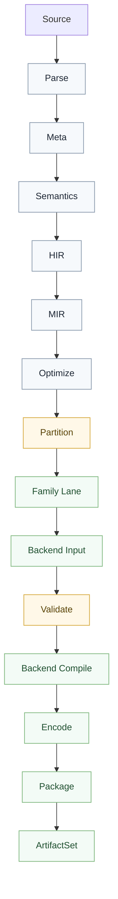

# 架构详解

## 目标

`valkyrie.v` 的长期架构只追求三件事：

- 语言语义长期稳定，不因为新增 target 而被反向污染。
- target 能持续扩展，不靠统一大 `IR`、统一大 backend 或 emit 兜底补语义。
- 交付物可运行、可调试、可验证，而不只是“生成了一个文件”。

这套架构明确拒绝两类失败路线：

- 把所有 target 硬塞进一份统一物理 `IR`，最后演变成新的 `god ir`。
- 把语义、lowering、编码、打包、入口包装和宿主绑定塞进同一个大对象或大模块，最后演变成 `god object`。

## 核心原则

### 1. 统一的是语义主线，不是统一物理 `IR`

`valkyrie.v` 允许所有 target 共用一条语义主线，但不要求共用一份最终低层表示。

固定主线如下：

其中：

- `HIR` 是高层语义表示。
- `MIR` 是中层分析与优化表示。
- `Partition` 是 target family 分区点。
- `Backend Input` 是各 target family 自己的低层输入，不要求统一成一份共享物理模型。

### 2. 语义必须在前端闭合

下列事实必须在进入 target lane 之前闭合：

- 名称解析
- 类型检查
- 入口识别
- `trait / imply` 满足
- `row` 方法约束满足
- `class / unite` 名义关系
- effect 约束与能力边界
- 文本类型收敛

后端不得重新做这些判断，也不得在 emit 阶段偷偷补语义。

### 3. target family 必须前置分流

`Partition` 之后必须进入明确的 target family 路线，而不是继续维护“所有后端都能吃”的兼容壳。

当前长期 family 至少包括：

- `NyarVM`
- `CLR`
- `JVM`
- `WASM Browser/Node`
- `WASI`
- `Native`
- `Shader`（预留）

### 4. 后端先 `validate`，再 `compile`

每个后端都必须显式声明：

- 自己吃什么输入
- 自己不吃什么输入
- 哪些开放语义必须在进入前静态化
- 哪些缺口必须编译期硬失败

不允许“先生成点东西再说”。

### 5. 标准库语义与宿主绑定分离

`std` 只定义统一语义，宿主差异必须收口到 adaptor 层。

例如：

- `std.io.print`
- `std.fs.read_all_text`
- `std.time.now`
- `std.net.http`

这些能力应先作为稳定语义存在，再由 `std.adaptor.*` 绑定到不同宿主。

## 五层结构

### 语言层

语言层负责：

- 语法解析
- 语义分析
- 类型系统
- `HIR`
- `MIR`

语言层不负责：

- 目标 ABI
- 文件格式
- 入口包装
- sidecar
- 宿主胶水

### 优化与分区层

这一层负责：

- 静态化
- 去虚化
- 规则重写
- 常量折叠
- 体积预算
- 模块拆分
- target family 分区

这一层不负责：

- 目标文件编码
- 宿主包装
- 平台专用导入清单

`Optimize` 可以使用 `EGraph`，也可以使用其他机制；但它只是优化基础设施，不是语言真相本身。

### target lane 层

每个 target family 一条独立 lane：

- lane 只做本 family 需要的 lowering
- lane 不重新解释语言语义
- lane 产出 family 专用 `Backend Input`
- lane 之间不共享统一物理终态

### 编码与格式层

这一层负责：

- 二进制格式数据模型
- 编码
- 解码
- 结构校验

它不负责：

- 名称解析
- 类型推导
- trait 选择
- 标准库绑定

### 交付与工具层

这一层负责：

- workspace
- build graph
- 缓存
- `CanonicalTarget`
- `ArtifactSet`
- `RunContract`
- sidecar 产物
- 验证记录

它不负责：

- 前端语义
- target lowering
- 文件格式编码

## 仓库职责映射

### `projects/core`

只放语言固有 primitive、marker、基础类型与核心约束。

### `projects/std`

只放统一语义标准库，不直接承载平台差异。

### `projects/std.adaptor.*`

只放宿主绑定与平台能力映射。

当前这层是长期商业竞争力的重要来源之一，因为它决定同一套语言语义能否稳定落到多个宿主。

### `projects/std.data.binary.*`

只放目标格式数据模型与编解码契约，不反向承担语言语义。

### `projects/nyar.vm.*`

只放执行引擎、运行模型或目标家族运行约定。

### `projects/legion.tools`

只放工程工具链能力，不反向长成编译器核心。

### `projects/asgard` 与 `projects/atlas`

属于上层框架，不参与定义底层编译边界。

## 标准编译主线

这条主线里最重要的分界线有三处：

- `Semantics` 之后，语言真相必须闭合。
- `Partition` 之后，target family 必须分流。
- `Validate` 之后，后端只允许消费合法输入。

## `CanonicalTarget` 原则

整个仓库内部只认 `CanonicalTarget`，不再维护第二套并行目标身份。

围绕 `CanonicalTarget` 需要稳定派生出：

- `BackendFamily`
- `HostKind`
- `AbiProfile`
- `OutputKind`
- `EntryPolicy`
- `StdLibBindingPolicy`
- `DebugArtifactPolicy`

这保证 target 差异是显式契约，而不是散落在后端里的 `if/else`。

## `ArtifactSet` 原则

编译成功的定义不是“生成了主文件”，而是产出一组完整交付物：

- `PrimaryArtifact`
- `SidecarArtifacts`
- `DebugArtifacts`
- `ValidationRecords`
- `RunContract`

未来所有 target 都应以这组结果作为交付统一面，而不是各自拼目录。

## 永久禁止事项

- 禁止重新发明“所有 target 共用的唯一低层 `IR`”
- 禁止在后端里补做语言级 resolve
- 禁止让 `std` 本体长出 `windows / wasi / jvm / browser` 特判
- 禁止让 `legion.tools` 反向依赖编译器内部细节
- 禁止把 `std.data.binary.*` 反向提升成语言语义层
- 禁止用 emit 层兜底修补上游遗漏的语义事实
- 禁止为了支持一个新 target 污染所有公共数据结构

## 一句话架构

`valkyrie.v` 的长期路线不是“做一个比 `MLIR` 更大的统一系统”，而是：

语义在前端闭合，target 在分区后分流，lane 产出各家 backend input，后端先 `validate` 再 `compile`，标准库语义与宿主绑定分离，最终统一交付为 `ArtifactSet`。

## 相关文档

- [编译管线逐阶段详解](../maintainer/compilation.md)
- [目标家族契约](../maintainer/target-family-contract.md)
- [Canonical Target 规范](target-triples.md)
