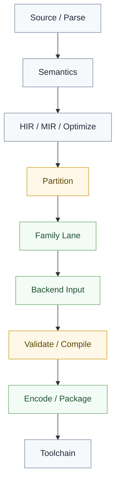

# 依赖规则

## 总原则

依赖方向必须服务于长期架构边界，而不是延续某条旧仓库的历史分层。

对 `valkyrie.v` 当前路线来说，最重要的不是记住一串旧项目名，而是守住下面这些方向：

- 语言语义层不依赖宿主绑定层
- 公共中层不依赖具体 family 实现
- 编码与打包层不反向定义语言语义
- 工具链层不反向长成编译器核心

## 推荐分层

依赖只能沿这个方向向下走，不能逆流。

## 仓库层面的职责

### `projects/core`

- 只放语言固有 primitive、核心约束和稳定基础类型

### `projects/std`

- 只放统一语义标准库
- 不直接承载宿主差异

### `projects/std.adaptor.*`

- 只放宿主绑定
- 不反向提升成语言主线

### `projects/std.data.binary.*`

- 只放目标格式数据模型与编码契约
- 不承担语言语义解释
- 包名按真实格式：如 `std.data.binary.class`、`std.data.binary.jar`；禁止写成 `std.data.binary.jvm`（无 `jvm` 格式）

### `projects/std.data.text.*`

- 文本格式模型；Valkyrie（`.v`）AST/CST/span 在 **`std.data.text.valkyrie`**
- **禁止**平行包 `std.data.text.v`（`.v` 只是后缀，不是第二门语言 / 独立 crate）
- `nyar.language` 消费上述模型，不长期私有一份平行 AST

### `projects/nyar._/projects/nyar.vm.*`

- 只放执行环境或特定 family 运行契约
- **只消费** `nyar.emitter` 产物，**不得**依赖 `nyar.language` / AST

### `projects/nyar._/projects/nyar.language` → `nyar.analyzer` → `nyar.optimizer` → `nyar.emitter`

- 同构主线；emitter 各 lane 输入为 **`ExecutableModule`**（全称，禁止 `Exec` / `ExecModule` 简写）
- 禁止把 `body_source` / `clr_body_lowering` 旁路或 type-name 特判当作正式依赖边

### `projects/legion._/projects/legion.tools`

- 只放工程工具链能力
- 不反向承担前端语义、middle-end 或 lowering 责任
- 物理路径在 `legion._` 下；报告包为同级 `legion.report`

### `projects/unity._/projects/{unity.engine.sdk,valkyrie.unity}`

- Unity SDK 与插件源码均在 `unity._` 子 workspace，不在顶层 `projects/`
## 明确禁止

- 禁止后端依赖前端补丁式语义兜底
- 禁止工具链层依赖编译器内部私有对象图
- 禁止某个 family 的数据结构泄漏成全部公共层的必选字段
- 禁止把编码格式层反向抬升成统一低层 `IR`
- 禁止把宿主绑定塞回 `std` 本体
- 禁止 `nyar.vm.*` 依赖 `nyar.language`
- 禁止用旁路 lowering 替代 `ExecutableModule`→emitter 同构边
## 编译器与包管理分离

这是必须长期维持的规则：

- `VCC` 不依赖包管理器实现细节
- `Legion` 可以调用 `VCC`
- 替换包管理器不应改变编译器语义

共享边界应当是清晰的构建输入、依赖闭包和交付契约，而不是私有内部对象。

## 一句话原则

任何依赖一旦让工具链反向定义编译器、让后端反向定义语言语义，或让单一 family 污染公共层，就说明依赖方向已经坏掉。
