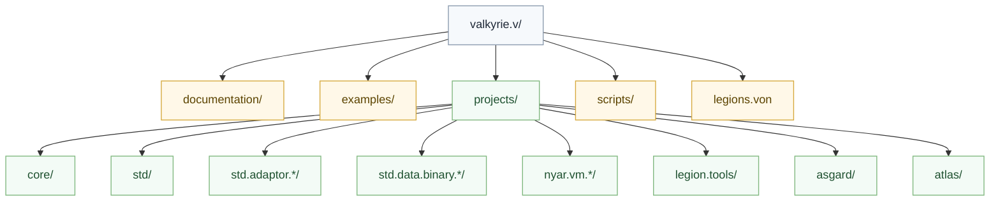

# 参与贡献

## 项目结构

## 设计文档

- [架构详解](architecture.md)
- [公共图形栈](graphics-stack.md)
- [Canonical Target 规范](target-triples.md)
- [编译管线逐阶段详解](../maintainer/compilation.md)
- [目标家族契约](../maintainer/target-family-contract.md)

## 贡献前先记住

- 统一的是语义主线，不是统一物理 `IR`
- `std` 只表达统一语义，平台差异放到 `std.adaptor.*`
- target 必须按 family 分流，不继续维护“所有后端都能吃”的兼容壳
- 后端必须先 `validate` 再 `compile`
- 交付成功的标准是完整 `ArtifactSet`，不是单一主文件

## 代码审查清单

- [ ] 没有把平台特判塞进 `std`
- [ ] 没有把语言语义下沉到后端或工具层
- [ ] 没有引入新的统一大 `IR` 或统一大对象
- [ ] 文档与代码边界一致
- [ ] 示例或测试覆盖新边界
