# 标准库架构

`std` 的目标不是给所有 target 准备一份巨大的平台混合实现，而是提供稳定、长期可维护的语言级语义表面。

真正的平台差异必须在 `std.adaptor.*` 与各 `target family` 的 backend 契约中落地，不能重新把标准库做成新的 `god object`。

## 核心原则

- `std` 只表达跨平台成立的语义接口，不直接承担宿主平台细节
- 平台、运行时、宿主 API 差异放到 `std.adaptor.*`
- 标准库能力是否可用，必须在编译期由语义层和 family `validate` 明确判定
- 不支持的能力必须编译期硬失败，禁止在 emit 或运行期偷偷降级
- `std` 的统一来自语义契约，不来自“一份所有后端共用的底层实现”

## 分层模型

```mermaid
flowchart LR
    Std[std.*]
    SemanticAPI[语言级语义接口]
    Middle[HIR / MIR 中保留能力边界]
    Partition[Partition]
    Lane[target family lane]
    Adaptor[std.adaptor.<family>.* / std.adaptor.<host>.*]
    BackendInput[Backend Input]
    Validate[Validate]
    Compile[Compile]
    ArtifactSet[ArtifactSet]

    Std --> SemanticAPI --> Middle --> Partition --> Lane --> Adaptor --> BackendInput --> Validate --> Compile --> ArtifactSet

    classDef phase fill:#f6f9fc,stroke:#8a9aad,stroke-width:1.2px,color:#1f2937;
    classDef boundary fill:#fff8e8,stroke:#d6a93d,stroke-width:1.2px,color:#5c4400;
    classDef delivery fill:#f3fbf6,stroke:#7fb77e,stroke-width:1.2px,color:#1f5130;

    class Std,SemanticAPI,Middle phase;
    class Partition,Validate boundary;
    class Lane,Adaptor,BackendInput,Compile,ArtifactSet delivery;
```

这里最关键的边界有两个：

1. `std` 不直接依赖 `windows / wasi / jvm / browser` 这类宿主细节。
2. `Partition` 之后才允许进入不同 family 的 adaptor 和 backend 路线。

## 模块职责

### `std.*`

`std.*` 只定义语言承诺给用户的通用能力，例如：

- `std.console`
- `std.math`
- `std.json`
- `std.crypto`
- `std.url`

这些模块可以声明统一 API、错误模型、数据结构和能力边界，但不应该内嵌特定宿主 API 名称、ABI 细节或打包方式。

### `std.adaptor.*`

`std.adaptor.*` 负责把统一语义接到具体宿主或 family 能力，例如：

- `std.adaptor.browser.*`
- `std.adaptor.wasi.*`
- `std.adaptor.windows.*`
- `std.adaptor.jvm.*`
- `std.adaptor.clr.*`

这些 adaptor 可以依赖宿主 API、运行时对象模型、系统调用约定和打包布局，但不能反向污染 `std` 本体。

## 能力开放规则

不是所有标准库模块都对所有 target 开放。可用性必须由能力声明决定，而不是靠命名约定或后端兜底猜测。

示例：

- `std.dom`、`std.storage`、`std.fetch`、`std.timer` 更接近 `browser` / `web host` 能力
- `std.console`、`std.math`、`std.json`、`std.crypto` 更接近通用计算能力
- `std.fs`、`std.process`、`std.net` 这类能力如果未来加入，也必须显式声明宿主前提

如果目标是 `wasm-browser`，则 web 相关模块可以通过对应 adaptor 打开；如果目标是纯 `native` 或受限 `wasi`，则必须由 `validate` 明确确认哪些能力可用、哪些能力禁止。

## 标准库与后端的关系

后端不重新解释标准库的语言语义。后端只消费已经完成语义闭合、并且已经分流到对应 family 的 `Backend Input`。

换句话说：

- 标准库的语义归属在前端和中层
- 标准库的平台接线归属在 `std.adaptor.*`
- backend 负责验证输入是否满足本 family 契约，并生成目标产物

## 永久禁止事项

- 禁止让 `std` 本体长出 `windows / wasi / jvm / browser` 特判
- 禁止把 adaptor 写成所有平台都往里堆的统一巨型桥接层
- 禁止让 backend 在编译末端补做标准库语义 resolve
- 禁止因为某个 target 的需要污染所有公共标准库数据结构
- 禁止把宿主 API 直接当成语言标准库契约本身
