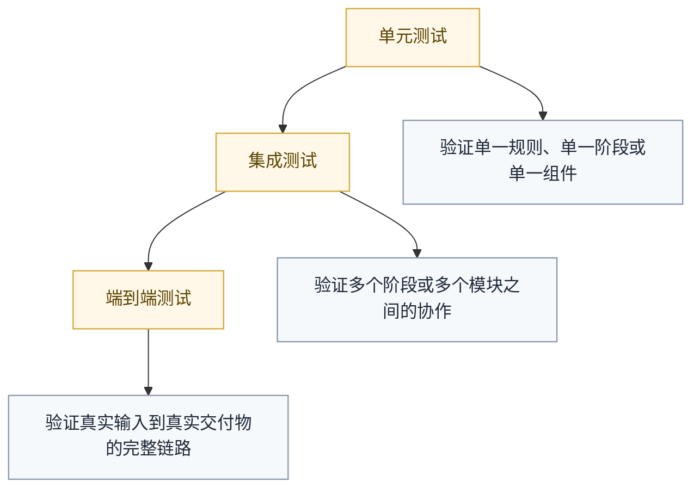
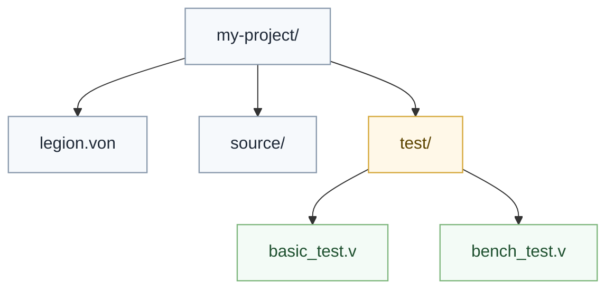

# 测试指南

## 测试分层



测试的目标不是重复实现细节，而是验证长期稳定边界是否仍然成立。

## 重点测试什么

在当前架构下，优先测试这些边界：

- 语义是否在前端闭合
- `Partition` 后是否按 family 正确分流
- family `validate` 是否按预期失败或通过
- `ArtifactSet` 是否完整
- `std` 与 `std.adaptor.*` 的边界是否被破坏

## `Valkyrie` 项目测试

`Valkyrie` 项目使用 `legion test`、`legion bench`、`legion coverage` 这一组命令。

### 目录约定



### 测试标注

测试函数可以使用 `[test]` 或 `test` 标注：

```v
[test]
micro easy_if_1() -> unit {
    let max = if a > b { a } else { b }
}

test micro easy_if_2() -> unit {
    let max = if a > b { a } else { b }
}
```

### 基准标注

```v
[benchmark]
micro easy_if_3() -> unit {
    # 基准逻辑
}
```

### 测试专用依赖

测试依赖应显式标记为测试可见，避免污染生产构建闭包。

```von
dependencies: {
    "some_name": {
        version: true,
        test: true,
    }
}
```

## 运行测试

```bash
legion test
legion test examples/test.if_expression
legion test --filter easy_if
legion test --target nyar,clr,jvm
legion test --verbose
```

## 多目标测试

`legion test` 可以在多个目标上执行，但要把“测试目标”和“语言语义”分开看：

- 语言语义只闭合一次
- 不同 target 只负责承载同一份已闭合语义
- 某个 family 不支持的能力应在 `validate` 阶段明确失败

典型目标包括：

- `nyar`
- `clr`
- `jvm`
- `node`

每个目标的中间产物应当隔离在测试缓存目录中，而不是与最终交付目录混放。

## Runner 原则

Runner 只是执行测试产物的宿主适配层，不是新的语言语义层。

维护时应坚持：

- Runner 只负责启动对应宿主
- Runner 不补做编译期语义判断
- Runner 配置不应反向影响前端语义结果

## 基准与覆盖率

### 基准

```bash
legion bench
legion bench --runs 10
legion bench --target nyar,clr
```

### 覆盖率

```bash
legion coverage
legion cov
```

覆盖率更适合衡量规则覆盖和语法路径覆盖，不应被误用为实现质量的唯一指标。

## 编写测试的原则

- 小而准地验证一个边界
- 优先覆盖回归风险高的阶段边界
- 少写重复实现细节的测试
- 避免把单一后端的行为误写成全局语言规则

## 一句话原则

测试要围绕长期边界组织，而不是围绕某个旧运行时或旧内部对象模型组织。
