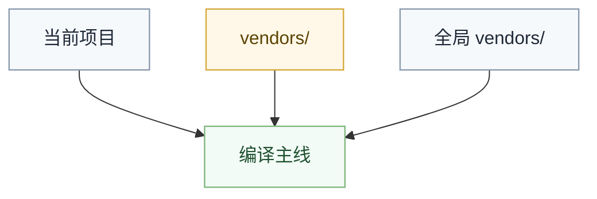

# Vendors 规范

`vendors/` 目录是包管理与编译主线之间的共享依赖视图。

它的职责是向编译主线暴露已经解析完成的外部依赖结果，而不是把包管理器内部状态、注册表实现细节或网络协议直接带进编译器。

## 目录定位

`vendors/` 只回答三个问题：

- 依赖来自哪个注册表
- 依赖在本地以什么路径呈现
- 编译主线如何稳定地找到它

它不负责：

- 参与语义分析
- 记录包管理器内部缓存策略
- 充当新的构建脚本总线

## 路径格式

```
vendors/<registry>@<endpoint>/<org>.<package>@<version>/
```

```mermaid
flowchart LR
    Registry[registry]
    Endpoint[endpoint]
    Package[org.package]
    Version[version]
    VendorPath[vendors/<registry>@<endpoint>/<org>.<package>@<version>/]

    Registry --> VendorPath
    Endpoint --> VendorPath
    Package --> VendorPath
    Version --> VendorPath

    classDef phase fill:#f6f9fc,stroke:#8a9aad,stroke-width:1.2px,color:#1f2937;
    classDef boundary fill:#fff8e8,stroke:#d6a93d,stroke-width:1.2px,color:#5c4400;
    classDef delivery fill:#f3fbf6,stroke:#7fb77e,stroke-width:1.2px,color:#1f5130;

    class Registry,Endpoint,Package,Version phase;
    class VendorPath delivery;
```

| 元素 | 说明 | 示例 |
|:---|:---|:---|
| `registry` | 注册表名称 | `npm`、`maven`、`valhalla` |
| `endpoint` | 注册表端点 | `registry.npmjs.org`、`search.maven.org` |
| `org` | 组织名（无组织用 `_`） | `_`、`google`、`microsoft` |
| `package` | 包名（作用域 `@` 替换为 `.`） | `eslint`、`react`（原 `@types/react` → `types.react`） |
| `version` | 包版本 | `2025.1.0.0`、`1.0.0` |

## 路径示例

| 来源 | vendors 路径 |
|:---|:---|
| 从 `npm` 获取 `eslint` | `vendors/npm@registry.npmjs.org/_.eslint@9.0.0/` |
| 从 `npm` 获取 `@types/react` | `vendors/npm@registry.npmjs.org/types.react@18.0.0/` |
| 从 `npm` 获取 `@google/model-viewer` | `vendors/npm@registry.npmjs.org/google.model-viewer@3.5.0/` |
| 从 `maven` 获取 `com.google.guava` | `vendors/maven@search.maven.org/com.google.guava@33.0.0-jre/` |

## 目录结构

```json
{
    "name": "eslint",
    "version": "9.0.0",
    "registry": "npm",
    "resources": [
        { "type": "assembly", "path": "index.js" },
        { "type": "source", "path": "src/" }
    ]
}
```

## 不嵌套

编译主线只在 `vendors/` 的直接子目录中查找依赖，不递归。

这样做是为了：

- 保持依赖视图扁平
- 防止包管理器私有布局泄漏进编译器
- 避免把嵌套依赖树重新做成新的公共对象模型

## 优先级

编译主线按以下顺序查找依赖：

| 优先级 | 来源 | 说明 |
|:---|:---|:---|
| 1 | 当前项目 | 同项目中的其他模块 |
| 2 | `vendors/` | 包管理阶段已解析完成的依赖 |
| 3 | 全局 `vendors/` | 系统级全局依赖 |



## 设计原理

| 规则 | 理由 |
|:---|:---|
| 不递归 vendors | 避免嵌套，保持依赖扁平化 |
| 无组织名用 `_` | 区分作用域 `@` 替换为 `.` |

## 一句话原则

`vendors/` 只暴露稳定依赖视图，不暴露包管理器的内部世界。
