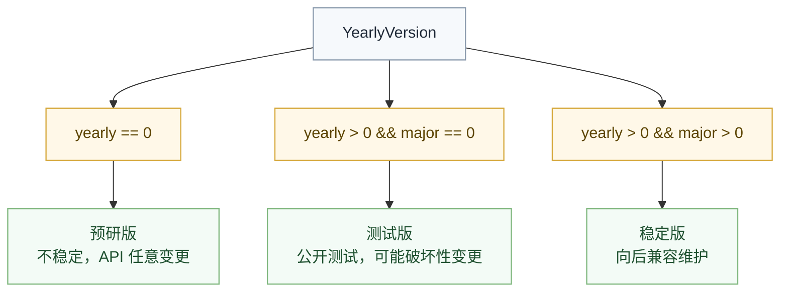

# 版本规范

版本号是发布契约的一部分，作用是描述源码包、构建产物和公开依赖的演进关系。

它不应承担这些职责：

- 暗示某个旧运行时代际
- 绑定某个宿主实现对象模型
- 用历史项目名替代真实兼容性语义

当前推荐保留双版本号体系，但解释必须围绕发布与兼容性，而不是围绕历史实现。

## YearlyVersion 格式

```
yearly.major.minor.patch
```

| 字段 | 范围 | 含义 |
|:---|:---|:---|
| `yearly` | `[0, ∞)` | 年度标识符。`0` 预研版，`>0` 正式 |
| `major` | `[0, ∞)` | 大版本。`0` 测试版，`>0` 稳定 |
| `minor` | `[0, ∞)` | 小版本 |
| `patch` | `[0, ∞)` | 补丁版本 |

## 稳定状态判断



与传统 `SemVer` 的关键区别是：`YearlyVersion` 通过 `yearly=0` 和 `major=0` 两个维度显式表达预研期和测试期，避免把稳定性藏在额外后缀里。

## 版本号选择

**Yearly Version 的序列比单一数字更可读：**

| 传统 SemVer | YearlyVersion |
|:---|:---|
| `1.0.0` | `2024.1.0.0` |
| `1.0.1` | `2024.1.0.1` |
| `2.0.0` | `2025.1.0.0` |

相比单调递增的 `major`，`YearlyVersion` 更容易表达一个发布序列所处的时间窗口。

## 比较规则

按以下顺序比较：
1. yearly（越大越新）
2. major
3. minor
4. patch

## SemanticVersion

传统的 `major.minor.patch` 格式用于程序化版本比较，便于与通用依赖工具和版本解析器协作。

| 字段 | 范围 | 含义 |
|:---|:---|:---|
| `major` | `[0, ∞)` | 破坏性变更 |
| `minor` | `[0, ∞)` | 向后兼容新增功能 |
| `patch` | `[0, ∞)` | 向后兼容修复 |

## 使用建议

- 面向人阅读的发布线，可以优先展示 `YearlyVersion`
- `std` 等核心包以 `yearly.major.minor.patch` 发布，例如 `2020.0.0.0`
- 面向工具协作和依赖求解的场景，应保留 `SemanticVersion`
- 文档里描述兼容性时，要直接写清“是否破坏 API / ABI / 包格式”，不要只给版本号让读者自己猜

## 一句话原则

版本号只描述发布与兼容性，不描述旧实现谱系。
