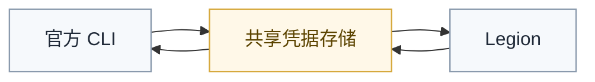
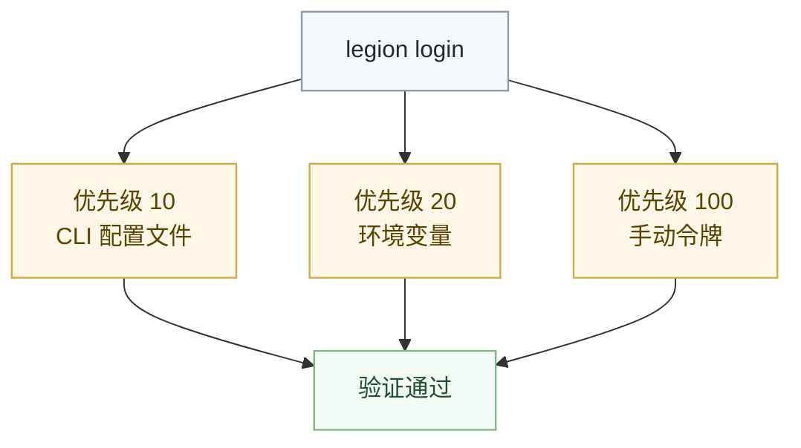

# 注册表配置

`Legion` 通过注册表适配契约接入多种依赖来源，对外提供统一的依赖解析体验。

## 内置注册表

| 注册表 | 适配器 | 默认端点 |
|:---|:---|:---|
| npm | `npm` 适配器 | `https://registry.npmjs.org` |
| jsr | `jsr` 适配器 | `https://jsr.io` |
| conda | `conda` 适配器 | `https://api.anaconda.org` |
| NuGet | `nuget` 适配器 | `https://api.nuget.org/v3` |
| Maven Central | `maven` 适配器 | `https://search.maven.org` |
| Valhalla | `valhalla` 适配器 | `https://valhalla.nyar.dev` |

## 认证互通

**Legion 的登录与各注册表的官方 CLI 工具登录状态完全互通。** 无论用官方工具登录还是用 Legion 登录，另一方都可以直接使用已验证的凭据。

```
npm login        ←→ legion login      （共享 ~/.npmrc）
deno login       ←→ legion login      （共享 deno/config.json）
anaconda login   ←→ legion login      （共享 nucleus/tokens.json）
nuget setapikey  ←→ legion login      （共享 NuGet.Config）
maven settings   ←→ legion login      （共享 ~/.m2/settings.xml）
```

**只需登录一次，所有工具都能用。**



## 自动凭据发现

`legion login` 自动按优先级顺序尝试发现凭据：

1. **优先级 10** — 官方 CLI 配置文件（如 `.npmrc`、`settings.xml`）
2. **优先级 20** — 环境变量（如 `NODE_AUTH_TOKEN`、`NUGET_API_KEY`）
3. **优先级 100** — 手动输入的令牌



```bash
# 如果已通过 npm CLI 登录过，直接运行
legion login
# → 自动从 ~/.npmrc 发现令牌 → 验证通过 → 登录成功
```

## 认证命令

```bash
legion vendor login <name>              # 登录（自动凭据发现）
legion vendor login <name> --token <t>  # 登录（手动令牌）
legion vendor logout <name>             # 退出登录
legion vendor whoami <name>             # 查看当前用户
legion vendor list                      # 列出所有 Vendor
legion vendor refresh <name>            # 刷新凭据
```

## 令牌存储

登录成功后令牌安全存储在 `~/.valkyrie/auth.von`：

```
{
    npm: {
        endpoint: "https://registry.npmjs.org",
        token: "***已混淆***",
        user: "your-username",
        loggedInAt: "2026-05-01T12:00:00Z"
    }
}
```

## 注册表源配置

`~/.valkyrie/registry-sources.von` 存储注册表端点：

```
{
    npm: "https://registry.npmjs.org",
    jsr: "https://jsr.io",
    conda: "https://api.anaconda.org",
    maven: "https://search.maven.org",
    nuget: "https://api.nuget.org/v3",
    valhalla: "https://valhalla.nyar.dev"
}
```

## 指定注册表

依赖声明中可指定注册表：

```
[dependencies]
my-package = { version = "1.0.0", registry = "npm" }
```

未指定时使用默认注册表。

## 自定义注册表

新增自定义注册表时，应实现一层最小适配器，把外部注册表的能力映射到 `Legion` 可识别的统一依赖操作。

最小能力通常包括：

- 读取包元数据
- 搜索包
- 下载包
- 列出版本
- 验证凭据

如果某个注册表还支持发布，则可继续补充发布能力；如果不支持，也不应为了接口整齐强行伪造发布语义。

接入原则：

- 适配器只负责注册表协议与凭据交互
- 适配器不反向承担编译主线职责
- 适配器输出应稳定落入 `vendors/` 依赖视图
