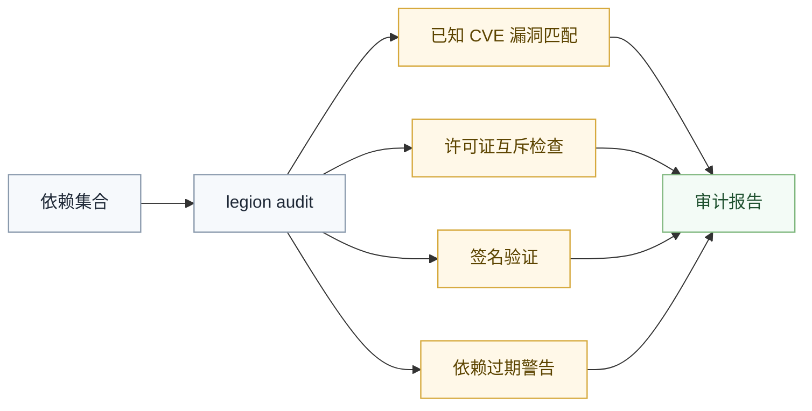

# 安全审计

Legion 安全审计功能扫描依赖中的已知漏洞，支持自动修复。

## 基本用法

```bash
legion audit              # 审计所有依赖
legion audit <pkg>        # 审计指定包
legion audit --fix        # 自动修复
legion audit --json       # JSON 格式输出
```

## 审计范围

- 已知 CVE 漏洞匹配
- 许可证互斥检查
- 签名验证（Valhalla 注册表）
- 依赖过期警告



## 审计输出示例

```
🔍 审计 my-package@2025.1.0.0

  ⚠️ dep-a@1.0.0 — CVE-2025-1234（中危）
    建议升级到 1.0.1+
  
  🔴 dep-b@2.0.0 — CVE-2025-5678（高危）
    已自动修复 → 2.0.1

  ℹ️ dep-c@3.0.0 — 许可证 GPL-3.0 与项目 MIT 有潜在冲突

审计完成: 1 高危已修复 / 1 中危待处理 / 1 信息提示
```

## 自动修复

`--fix` 选项自动更新存在已知漏洞的依赖到修复版本：

```bash
legion audit --fix
```

Legion 尝试将漏洞依赖升级到同一 major 范围内的最新补丁版本。如果不存在安全版本，会提供手动处理建议。
