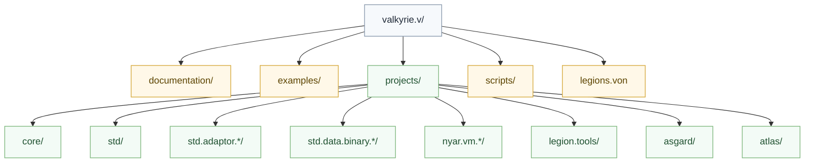

# 项目介绍

`valkyrie.v` 是语言、编译器、标准库与工具链文档的总入口。它当前优先解决的是长期架构问题：如何让语言语义稳定、后端按 family 分流、交付物可维护，并且不再滑回统一大 `IR` 或统一大 backend。

## 当前重点

- 统一的是语义主线，不是统一物理低层模型
- `Partition` 之后必须按 `target family` 分流
- 后端必须先 `validate` 再 `compile`
- `std` 与 `std.adaptor.*` 必须分离
- 编译成功的标准是完整 `ArtifactSet`，不是单一主文件

## 编译主线

这条主线表达的是长期边界：

- 语言语义在前端闭合
- family 分流发生在 `Partition` 之后
- 目标差异进入各自 lane，而不是回灌到公共层

## 文档阅读顺序

### 开发者

1. [开发者入口](developer/index.md)
2. [架构详解](developer/architecture.md)
3. [标准库架构](developer/standard-library.md)
4. [Canonical Target 规范](developer/target-triples.md)

### 维护者

1. [维护者入口](maintainer/index.md)
2. [编译管线逐阶段详解](maintainer/compilation.md)
3. [目标家族契约](maintainer/target-family-contract.md)
4. [后端概览](maintainer/backends/index.md)

## 仓库结构

## 架构原则

- 不把所有 target 塞进统一低层表示
- 不把 lowering、编码、打包、宿主绑定塞进同一个大对象
- 不让单一 target 的需求污染全部公共结构
- 不让工具层反向承担编译器内部语义职责

## 生态子 workspace

当前 `valkyrie.v` 除编译器、标准库与工具链主线外，还为多套生态预留了独立子 workspace：

- [Unity 游戏生态](../../../projects/unity._/documentation/pages/zh-hans/index.md)
- [Godot 游戏生态](../../../projects/godot._/documentation/pages/zh-hans/index.md)
- [Gnosis 自研游戏引擎](../../../projects/gnosis._/documentation/pages/zh-hans/index.md)
- [Titan 深度学习框架](../../../projects/titan._/documentation/pages/zh-hans/index.md)
- [YY 数据库生态](../../../projects/yyds._/documentation/pages/zh-hans/index.md)

其中数据库生态的长期边界为：

- `yykv`：共享底层存储内核
- `yydb`：单机数据库，定位接近 `sqlite + redis`
- `yyds`：分布式数据库，协议兼容 `mysql / pgsql / redis`
- `yydb` 可作为 `yyds` 的 sidecar 高速缓存，但二者不是同一个产品
- **与 Atlas 无关**：yyds 是独立数据库生态，不是 Atlas 数据绑定 / ORM 平面；Atlas 的 Hermes（schema 真源 + 默认 query；SQL 亦可）→ RegenBindings / 一次性升级见 [atlas 数据访问](../../../projects/atlas._/projects/atlas/projects/atlas/readme.md#数据访问)

## 相关主题

- [语言参考](language/index.md)
- [工具链 · 架构边界](toolchain/architecture-boundaries.md)
- [工具链 · Legion](toolchain/legion.md)
- [工具链 · Noodle（Node）](toolchain/noodle.md)
- [工具链 · Panda（Python）](toolchain/panda.md)
- [开发指南](guides/getting-started.md)
