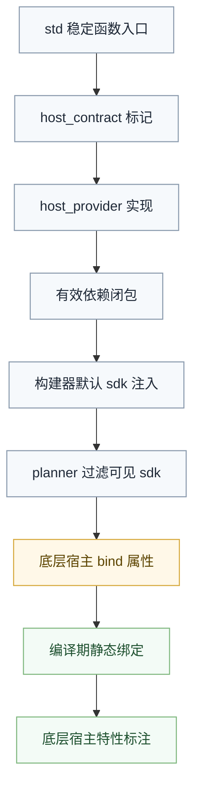

# SDK Vendor 体系

Valkyrie 的 `sdk` 体系用于承载“宿主平台 / 运行时 / 厂商 API 绑定”，并与 `std` 的稳定语义入口严格分层。它解决的问题不是“继续把更多宿主分支塞进 `std`”，而是“让官方、发行版默认实现与第三方平台能力都能在不打乱 `std` 结构的前提下，以 zero cost 方式为 `std` 提供可替换实现”。

## 设计目标

1. `std` 保持现有语义入口，例如 `std.net.get`、`std.console.write_line`，不新增一层 `std.host_contract.*` 命名体系。
2. `sdk` 负责宿主绑定，允许官方维护，也允许第三方或 vendor 自行维护。
3. `sdk` 的适配信息使用独立的 `sdk-vendor` 字段表达，不污染通用 `build` 体系。
4. 默认候选集来自有效依赖闭包，而不是只来自项目显式依赖；构建器可以按平台隐式注入默认 `sdk`。
5. 显式写出 `sdk` 依赖主要用于锁版本、测试版本、覆盖默认注入或收窄候选闭包。
6. `host_contract`、`bind`、`host_provider` 是三套正交能力：`host_contract` 定义宿主契约，`host_provider` 提供实现，`bind` 承载底层宿主绑定属性。
7. 最终产物只保留静态解析后的具体调用路径，保证 zero cost。

## 主题导览

| 文档 | 说明 |
|:---|:---|
| [分层模型](layering.md) | `std`、`sdk`、`std.adaptor.*`、第三方 `sdk` 与第三方构建器的职责边界 |
| [Host 与特性标注](hosts-and-attributes.md) | 先说明 `host_contract`、`host_provider`、`bind`，再说明特性标注如何承载这些语义 |
| [Manifest 与 Planner](manifest-and-planner.md) | `legion.von`、`sdk-vendor`、有效依赖闭包与装配规则 |
| [第三方 SDK](third-party-sdk.md) | 非官方 `sdk` 的发布、命名、注入策略与 `wechat` / `unity` 示例 |
| [第三方构建器](third-party-tool.md) | 第三方平台如何提供自己的构建器，并隐式注入默认 `sdk` |
| [Zero Cost 原则](zero-cost.md) | 编译期静态绑定、内联、死代码消除与禁止事项 |
| [迁移路线](migration.md) | 保留 `std.adaptor.*` 前提下向新模型演进 |

## 一句话原则

- `std` 暴露稳定函数入口。
- `host_contract` 标记哪些入口可由宿主提供方实现。
- `host_provider` 声明哪个函数严格实现某个 `host_contract`。
- `bind` 指的是底层宿主绑定属性，例如 `[clr]`、`[jvm]`、`[js_builtin]`、`[wasi]`。
- `sdk-vendor` 描述 `sdk` 自身适用范围。
- 第三方构建器可以隐式注入默认 `sdk`。
- 编译器在语义期静态完成绑定。

## 为什么不是废掉 `std.adaptor.*`

历史上的 `std.adaptor.*` 确实有架构问题，但发行版仍然需要它们作为默认供给层。否则官方发行版里没有任何预装宿主实现，用户开箱后连最基本的控制台、网络、文件等能力都无法直接使用。

因此新体系不是“先删掉 `std.adaptor.*` 再谈扩展”，而是：

1. 保留 `std.adaptor.*` 作为发行版默认 `sdk` 集合。
2. 允许第三方平台通过自己的构建器隐式注入专用 `sdk`。
3. 允许应用项目在需要时显式引入特定 `sdk` 锁版本或覆盖默认实现。
4. 逐步把旧 `adaptor` 收敛到统一的 `host_contract / bind / host_provider` 协议下。

## 最小心智模型

## 适用场景

- 官方平台 `sdk`：例如 `CLR`、`JVM`、browser、`WASI`
- 发行版默认 `sdk`：例如保留的 `std.adaptor.clr`、`std.adaptor.jvm`、`std.adaptor.wasm`
- 第三方 `sdk`：例如腾讯 `wechat`、Unity、Cloudflare Worker、Electron
- 企业内部 `sdk`：例如公司自有 runtime、网关、沙箱宿主
- 第三方构建器：例如微信小游戏构建器、Unity 导出与编译工具

## 非目标

本设计不试图：

1. 在运行时动态切换 `host_provider`。
2. 提供运行时反射式插件发现系统。
3. 让单个二进制在运行时同时装配多套宿主能力。
4. 让 `std` 自动联网下载第三方平台支持。

这些能力都与 zero cost 原则冲突，因此不属于本体系目标。
