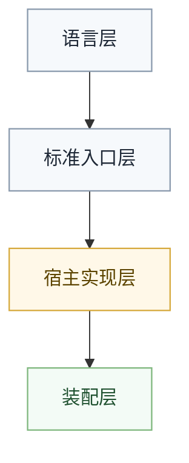
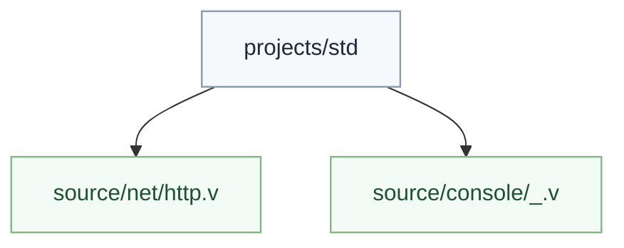
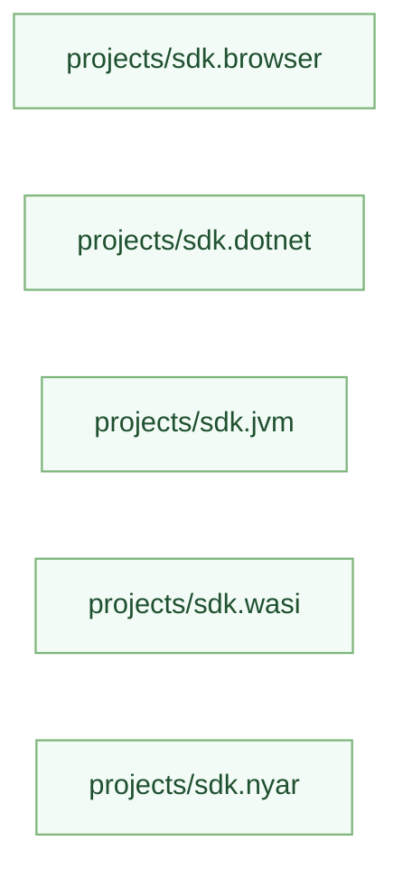
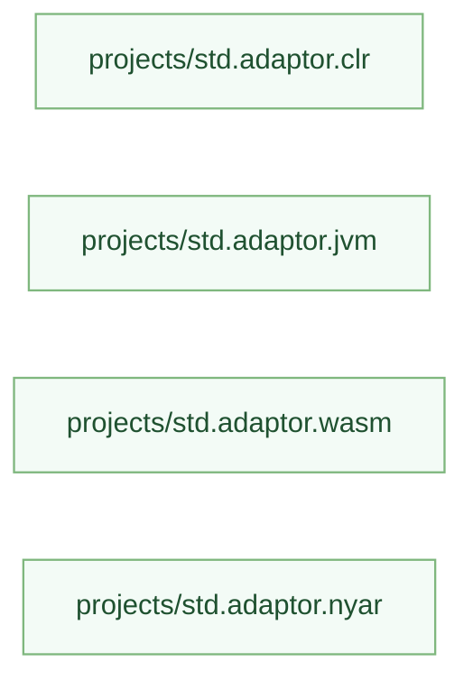
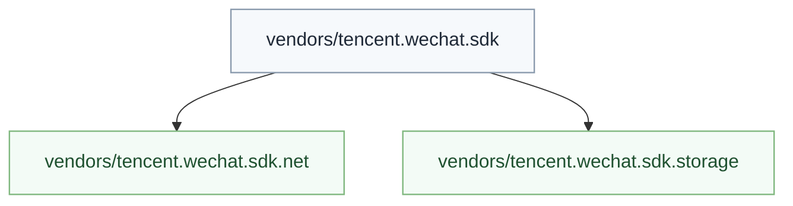

# 分层模型

## 总体结构

`sdk vendor` 体系把“稳定语义入口”和“宿主实现”拆成四层：

1. 语言层：提供特性标注、命名空间、路径解析、类型检查与编译期元数据语义。
2. 标准入口层：由 `std` 定义稳定函数入口与语义契约。
3. 宿主实现层：由 `sdk`、`std.adaptor.*` 或第三方 vendor 包提供 `host_provider`。
4. 装配层：由 `manifest`、planner 与第三方构建器共同决定当前构建的有效依赖闭包，并把 `host_provider` 候选集收敛到唯一实现。

## 职责边界

### `std`

`std` 只负责稳定语义入口，不直接承载宿主名字。

应放在 `std` 的内容：

- 集合、文本、迭代器、数学抽象、容器协议
- `std.net.request` 这种“稳定入口”
- `std.console.write_line` 这种“统一语义入口”
- 与宿主无关的数据结构和错误模型

不应放在 `std` 的内容：

- `wx.request`
- `fetch`
- `System.Net.Http.HttpClient`
- `java.net.HttpURLConnection`
- browser / Node / `wechat` 这种宿主识别分支

### `sdk`

`sdk` 负责宿主 API 绑定，是 `std` 的外部实现提供方。

典型职责：

- 提供底层 FFI 绑定
- 完成编码转换、句柄转换、异常包装
- 声明“我填充哪个 `std` 入口”
- 通过 `sdk-vendor` 声明自身适用范围

### `std.adaptor.*`

`std.adaptor.*` 仍然保留，而且在发行版中承担“默认 `sdk` 集合”的职责。

它的定位应当从“`std` 内部硬编码分支”收敛为：

- 发行版预装的官方 `host_provider`
- 没有显式第三方 `sdk` 时的默认供给
- 向新 `sdk vendor` 体系迁移时的兼容层

也就是说，新的体系不是把 `std.adaptor.*` 立即删除，而是把它们纳入统一协议。

### 第三方 `sdk`

第三方或厂商维护的包是 `sdk` 的一种特殊形式。它们不需要进入官方 `std` 仓库，只需要遵守统一协议即可。

例如：

- `tencent.wechat.sdk.net`
- `cloudflare.worker.sdk.fetch`
- `electron.sdk.fs`

### 编译器、planner 与第三方构建器

编译器和构建系统不实现宿主逻辑，只负责：

1. 收集 `host_contract` 标记
2. 收集 `host_provider` 声明
3. 基于显式依赖、发行版默认依赖和第三方构建器注入规则形成有效依赖闭包
4. 依据 `sdk-vendor` 与项目侧 `sdk` 配置过滤候选实现
5. 在符号解析阶段把 `std` 入口静态绑定到唯一 `host_provider`

第三方构建器只多承担两类平台职责：

1. 隐式注入默认 `sdk`
2. 处理平台自己的工程组织、打包、资源与发布流程

它不应反向改写语言语义，也不应绕过 planner 直接在后端偷偷替换 `host_provider`。

## 推荐目录形态

### 官方抽象包

### 官方宿主包

### 发行版默认包

### 第三方 vendor 包

命名不要求所有人都使用同一前缀，但必须满足两条约束：

1. 包名能稳定区分组织者与宿主。
2. `host_provider` 声明的导出路径在工作区中唯一。

## 命名原则

### 稳定入口命名

稳定入口用语义命名，而不是用宿主术语命名。

好例子：

- `std.net.request`
- `std.console.write_line`
- `std.storage.get_text`

坏例子：

- `std.fetch`
- `std.wx_request`
- `std.http_client`

### 宿主实现命名

宿主实现可以使用宿主原生术语，因为它本来就是平台绑定层。

例如：

- `tencent.wechat.net.wx_request`
- `sdk.browser.net.fetch_request`
- `sdk.dotnet.net.http_client_request`

## 为什么必须分层

如果没有这层边界，系统会退化成“`std` 里按 `arch` 写一堆条件分支”。这种方式在短期内简单，但长期会出现：

1. `std` 体积不断膨胀。
2. 宿主差异进入语言核心。
3. 第三方包无法独立演进。
4. target profile 与源码分支强耦合。
5. 同一能力无法在不同宿主下独立演化。

## 与旧 `adaptor` 的关系

旧的 `std.adaptor.*` 可以视为“发行版自带官方 `sdk`”：

- 若它只提供宿主实现，可以直接纳入新的 `host_provider` 协议
- 若它同时承担入口语义与宿主逻辑，应逐步拆分职责
- 若它仅是历史命名，可以保留包名，不强制立刻改成 `sdk.*`

## 设计原则

### 单一职责

- `std` 不选择宿主
- `sdk` 不定义语言抽象
- planner 不实现宿主 API
- backend 不参与 `host_provider` 选择

### 有效依赖闭包

某个项目的可见实现来自有效依赖闭包，而不是只来自显式 `dependencies`：

- 项目显式依赖决定用户主动锁定的部分
- 发行版默认 `std.adaptor.*` 决定官方开箱即用能力
- 第三方构建器可以按平台隐式注入默认 `sdk`

编译器不自动联网下载；若候选实现唯一则自动装配，若冲突则必须继续收窄依赖闭包，而不是引入额外项目级 `bind` 配置。

### 零运行时成本

分层只存在于源码与编译期，不应残留到运行时对象模型中。
