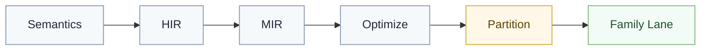
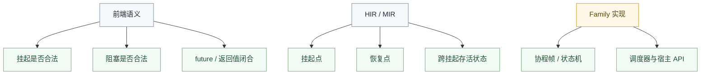

# async 编译边界

## 概述

异步语义的关键，不是某个具体状态机长什么样，而是哪些事实必须在前端和中层闭合，哪些事实可以留到不同 family 自己实现。

## 在管线中的位置

异步相关的上下文检查、类型闭合和控制流边界，必须在前端与中层完成。

## 语义阶段必须确认的事

至少要确认：

- 哪些位置允许挂起
- 哪些位置允许阻塞
- `future`、恢复值和返回值是否一致
- 当前函数是否因此具备异步边界

这些都属于语言规则，不能拖给后端决定。

## 中层需要保留的事实

进入 `HIR/MIR` 后，系统需要保留：

- 挂起点
- 恢复点
- 跨挂起仍然存活的局部状态
- 调度与恢复所需的最小控制流事实

这能支持后续把异步逻辑变成状态机、协程帧或其他 family 能接受的形式。

## 不应该在公共层固定的事

- 具体调度器 API
- 宿主线程模型
- 某个运行时的唤醒方式
- 某个 family 的对象布局

这些都不应该被抬升成统一公共模型。

## `.await`

`.await` 的语言语义是“挂起当前计算，等待结果恢复”。维护时要坚持：

- 它首先是控制流事实
- 它不是某个特定宿主 API 名称
- 它不是某个单一 family 的运行时调用约定

## `.awake`

`.awake` 这类“启动但不等待”的语义，也应该先在前端闭合为明确行为，再由 family 各自决定如何安排调度。

## `.block`

`.block` 这类阻塞行为必须在语义阶段就严格检查上下文。

原因很简单：

- 是否允许阻塞，属于语言和宿主规则
- 一旦放到后端再判，就会出现不同 target 行为分裂

所以，禁止阻塞的上下文必须尽早失败。

## Family 差异

不同 family 当然可以有不同实现：

- 某些路线偏向协程帧
- 某些路线偏向宿主任务系统
- 某些路线可能根本不支持某类异步语义

但这些差异只能体现在 family `validate` 与 `compile`，不能回灌到公共异步语义层。

## 失败信号

只要出现下面这些现象，就说明异步边界开始坏掉：

- 为某个 family 把公共异步模型绑死成专属状态机结构
- 在 backend 里重新判断某个位置能不能挂起
- 在 emit 阶段才决定 `.block` 是否允许
- 把宿主调度器 API 直接提升为语言语义

## 一句话原则

异步的语言规则必须前置闭合；不同 family 只实现自己的承载方式，不重新定义异步语义。
