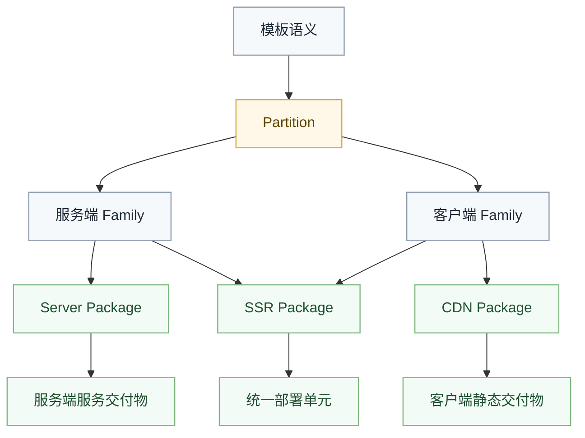

# AWSL 编译边界

## 概述

本文描述模板语言 `AWSL` 应该如何接入主编译线。核心原则是：模板前端可以有自己的前置转换，但不能重新发明一条脱离主线的统一编译世界。

## 在管线中的位置

```mermaid
flowchart LR
    AWSLSource[AWSL Source]
    AWSLParse[AWSL Parse]
    AWSLLowering[AWSL Frontend Lowering]
    SemanticMain[接入标准语义主线]
    HIR[HIR]
    MIR[MIR]
    Partition[Partition]
    FamilyLane[对应 Family Lane]

    AWSLSource --> AWSLParse --> AWSLLowering --> SemanticMain --> HIR --> MIR --> Partition --> FamilyLane

    classDef phase fill:#f6f9fc,stroke:#8a9aad,stroke-width:1.2px,color:#1f2937;
    classDef boundary fill:#fff8e8,stroke:#d6a93d,stroke-width:1.2px,color:#5c4400;
    classDef delivery fill:#f3fbf6,stroke:#7fb77e,stroke-width:1.2px,color:#1f5130;

    class AWSLSource,AWSLParse,AWSLLowering,SemanticMain,HIR,MIR phase;
    class Partition boundary;
    class FamilyLane delivery;
```



也就是说，`AWSL` 是语言入口扩展，不是新的总后端。

## 前置转换需要做什么

在接入标准主线前，`AWSL` 需要先把模板特有结构整理成可进入语言语义的形式，例如：

- 节点树
- 插值表达式
- 条件与循环模板结构
- 组件边界
- 岛屿与宿主提示

这一步的目标是消解模板表面语法，而不是提前决定目标平台细节。

## 不应该在前置转换里做什么

- 不应该提前固化某个浏览器 API
- 不应该提前决定最终打包形式
- 不应该把宿主桥接直接写成模板语言真相
- 不应该绕过标准 `Semantics -> HIR -> MIR -> Partition` 主线

## Web 相关能力

`AWSL` 常常与 `web` 能力关系紧密，但这不代表它可以跳过 family 边界。

正确边界应当是：

- 模板语义先进入标准语义主线
- `web` 相关事实在后续 `WASM Browser/Node` 路线中继续处理
- 宿主绑定、胶水与打包留到相应 family 与 package 阶段

## 组件与岛屿

像组件、岛屿、服务端片段、挂载提示这类概念，可以在前置转换中保留为语言级构件，但必须避免两种坏味道：

- 直接把它们写死成某个宿主框架私有对象模型
- 直接把浏览器打包策略写成公共语义结构

## 响应式（Solid 语义）

AWSL 模板表面是 Vue 风格，但 `<script>` 中的 **`let mut` 表示响应式状态**（细粒度更新图），**`let` 表示普通绑定**。二者都进入标准语义主线，最终在 WASM family 中落地：

- 模板插值 `{x}` 对 `let mut` 变量建立订阅
- 事件处理调用同文件 `micro`，不生成 JS 框架 runtime
- 不要求 `createSignal` / `ref` 等宿主 API

```
.awsl script: let mut count = 0
        ↓
RenderIR + V render micro（保留 let mut）
        ↓
HIR / MIR → WASM（信号 + dom_* 更新）
        ↓
boot.js + 胶水（仅加载与句柄绑定）
```

## SSR 与客户端边界

如果同一份模板需要服务端渲染与客户端激活，那么这件事也不能一概而论，而要看最终部署模型：

- 如果是 `CDN` 部署，客户端静态资源走 `CDN`，服务端仍然是独立服务交付
- 如果是 `SSR` 部署，才允许在交付阶段按运行契约把服务端与客户端资源组织成同一组部署单元
- 不管采用哪种模式，语义层都只保留必要边界
- `Partition` 之后再决定进入哪些 family 路线

也就是说，是否“合一”是部署与交付策略，不是模板前置转换阶段的职责。



## 与主线的关系

`AWSL` 接入完成后，后续仍然必须遵守主线约束：

- 语义在前端闭合
- `Partition` 后按 family 分流
- 后端先 `validate` 再 `compile`
- 最终以 `ArtifactSet` 交付

## 失败信号

出现下面这些情况时，说明 `AWSL` 边界开始坏掉：

- 模板前置转换直接生成某个 family 的终态输入
- 浏览器宿主细节被当成模板语言语义本身
- SSR、激活、胶水、打包被塞进同一个模板中间对象
- `AWSL` 自己长成一条平行的大而全编译管线

## 一句话原则

`AWSL` 可以有自己的前置转换，但最终必须回到统一语义主线，再在 `Partition` 后进入各自 family。
