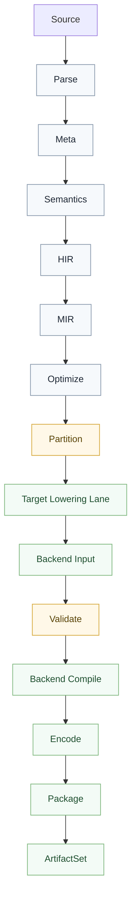

# 编译管线逐阶段详解

本文描述 `valkyrie.v` 的长期编译主线。核心目标不是把所有 target 塞进一份统一大 `IR`，而是让语义先闭合，再按 target family 分流，最后以统一交付契约落盘。

## 一张图

核心约束如下：

- `Parse -> Partition` 是语义主线，所有 target 共享。
- 包分层同构于 Rust：`nyar.language` → `nyar.analyzer` → `nyar.optimizer` → `nyar.emitter`；lane 消费 **`ExecutableModule`**（全称，禁止 `Exec` / `ExecModule`）。
- target 分叉从 `Partition` 开始，而不是从 parser、类型检查器或后端内部开始。
- `Validate` 是强约束，不是可选步骤。
- `nyar.vm.*` 只消费产物；`body_source` / type-name 特判旁路不是正式主线。

## 阶段 1：Parse

### 输入

- `.v`（Valkyrie 源码后缀；语言名与后缀是同一事物，解析模型在 `std.data.text.valkyrie`）
- `.awsl`
- 其他正式语言源文件

### 输出

- 带 `TextSpan` 的语法树
- 语法诊断

### 负责什么

- 文本解码
- token 化
- 语法解析
- 保留源位置信息

### 不负责什么

- 名称解析
- 类型检查
- target 推断
- 平台绑定

## 阶段 2：Meta

### 输入

- 语法树
- 编译配置
- `CanonicalTarget`

### 输出

- 已消除元节点的稳定语法树

### 负责什么

- 宏展开
- 编译期条件分支
- 代码生成模板的语法级展开

### 不负责什么

- 语义闭合
- target family lowering

## 阶段 3：Semantics

### 输入

- 稳定语法树
- 模块图
- 导入关系

### 输出

- `SemanticModel`
- 语言级诊断
- 逻辑入口信息

### 负责什么

- 名称解析
- 类型检查
- `trait / imply` 满足
- `row` 方法约束满足
- `class / unite` 名义关系判断
- effect 约束验证
- 文本类型收敛
- 逻辑入口识别

### 必须在这一层闭合的事实

- 当前调用到底是静态调用、见证调用还是其他语言级调用事实
- 某个方法、字段、构造器到底绑定到谁
- 某个文本字面量最终属于哪种文本类型

### 不负责什么

- 目标 ABI
- 文件格式
- 宿主入口包装
- 产物拼装

## 阶段 4：HIR

### 输入

- 稳定语法树
- `SemanticModel`

### 输出

- 高层语义表示 `HIR`

### 负责什么

- 把语法树转成已绑定的高层语义节点
- 保留语言特性语义，不急于抹平成低层细节
- 统一表达入口、调用、控制流、模式和文本语义

### 不负责什么

- 低层布局
- 目标调用约定
- 二进制格式字段

## 阶段 5：MIR

### 输入

- `HIR`

### 输出

- 中层分析表示 `MIR`

### 负责什么

- 把高层语义变成可分析、可重写、可静态化的表示
- 显式化控制流与数据依赖
- 承接后续优化与静态化

### 设计要求

- `MIR` 是语言与 target 之间的分析边界
- `MIR` 可以用 `SSA`、图结构、表达式岛或其他可分析形式实现
- `MIR` 不是所有 target 共用的最终物理格式

## 阶段 6：Optimize

### 输入

- `MIR`
- 优化级别
- target 预算信息

### 输出

- 已静态化、已去虚化、已收敛预算的 `MIR` 或等价结果

### 负责什么

- 常量折叠
- 规则重写
- 去虚化
- 部分求值
- 闭世界静态化
- 体积与首包预算控制

### 说明

这里可以使用 `EGraph`，也可以使用别的优化设施；但优化设施不构成语言真相本身。

### 不负责什么

- 文件格式编码
- 宿主桥接代码生成

## 阶段 7：Partition

### 输入

- 优化后的 `MIR`
- `CanonicalTarget`
- 构建配置

### 输出

- `ArtifactPartitionPlan`

### 负责什么

- 决定哪些代码进入哪个 target family
- 决定是否拆包、延迟加载、首包裁剪
- 决定后续进入哪条 lane

### 这是整条管线最关键的分界点

`Partition` 之后，不允许继续维持“所有后端都能吃”的兼容壳。必须按 family 进入各自路线。

## 阶段 8：Target Lowering Lane

### 输入

- 分区后的中层结果
- family 契约

### 输出

- family 专用 `Backend Input`

### 负责什么

- 把已经闭合的语义输入，翻译为本 family 可消费的低层输入
- 保持 family 自身约束，而不是继续伪装成统一低层模型

### 典型结果

- `CLR` 得到 `CLR` 专用 backend input
- `JVM` 得到 `JVM` 专用 backend input
- `WASM Browser/Node` 得到 `Wasm` 模块输入与宿主约束
- `WASI` 得到 `WASI` 所需模块输入与入口约束
- `Native` 得到 native family 自己的对象文件或机器码输入

## 阶段 9：Validate

### 输入

- `Backend Input`
- family 契约

### 输出

- 验证通过结果，或编译期错误

### 必须检查什么

- 输入是否真属于当前 family
- 是否仍残留当前 family 不支持的开放语义
- 是否仍有未闭合的调用、布局或入口事实
- 是否满足当前 family 的宿主约束与格式前提

### 原则

- `Validate` 必须早于 `Compile`
- 不支持的语义必须编译期硬失败
- 禁止 emit 兜底补语义

## 阶段 10：Backend Compile

### 输入

- 已通过验证的 family 输入

### 输出

- 目标格式数据结构

### 负责什么

- 指令选择
- 布局计算
- 调用约定映射
- metadata 组织
- 目标相关局部优化

### 不负责什么

- 名称解析
- trait 选择
- row 满足判断
- effect 选择
- 标准库语义解释

## 阶段 11：Encode

### 输入

- 目标格式数据结构

### 输出

- 主二进制字节流

### 负责什么

- 结构编码
- 格式校验
- 主产物字节输出

### 不负责什么

- 语言语义
- 入口胶水
- sidecar 拼装

## 阶段 12：Package

### 输入

- 主产物
- family 契约
- 宿主约束

### 输出

- `ArtifactSet`

### 负责什么

- 入口包装
- sidecar 产物
- `RunContract`
- 调试资产
- 验证记录聚合

### 说明

`Browser`、`Node`、`WASI`、`CLR`、`JVM` 的差异，大量发生在这一层，而不是 parser、类型检查器或通用 backend 层。

## `ArtifactSet` 是最终成功标准

编译成功不是“有个 `.wasm` 或 `.dll`”，而是至少具备：

- `PrimaryArtifact`
- `SidecarArtifacts`
- `DebugArtifacts`
- `ValidationRecords`
- `RunContract`

## 永久约束

- 禁止把 `MIR`、`Lane` 或 `Backend Input` 再膨胀成统一大 `IR`
- 禁止让后端补做语言语义判断
- 禁止让 `std` 直接知道宿主平台差异
- 禁止让工具层承担 lowering 职责
- 禁止为了单一 family 的短期需求污染所有公共结构

## 进一步阅读

- [架构详解](../developer/architecture.md)
- [目标家族契约](target-family-contract.md)
- [后端概览](backends/index.md)
