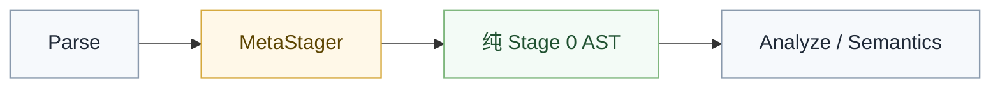
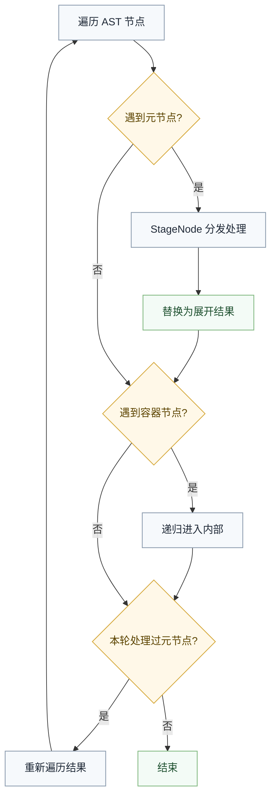

# 多阶段编程系统

## 概述

多阶段编程（Multi-Stage Programming, MSP）是一种元编程范式，允许程序在编译期生成或变换代码，同时通过严格的阶段分离避免传统宏系统的卫生性问题和组合性缺失。

Valkyrie 的 MSP 系统由 `MetaStager` 引擎驱动，位于编译管线中 Parse 与 Analyze 之间，负责对 AST 执行编译期变换，消除所有元代码节点（`<% ... %>`），最终生成纯 Stage 0 运行时代码。



## 核心概念

### 阶段划分

| 阶段 | 含义 | 执行时机 |
|:---|:---|:---|
| Stage 0 | 运行时 | 程序执行时 |
| Stage 1 | 编译期 | 编译器内 |
| Stage 2+ | 元编译期 | Stage 1 代码的编译期 |

每个阶段可以生成或操作后续阶段的代码，但禁止反向依赖，形成严格的有向无环依赖图。

### 卫生性

Valkyrie MSP 通过以下机制保证卫生性：

- **AST 级操作**：所有 escape 生成的是 AST 节点而非字符串，杜绝标识符拼接
- **作用域隔离**：每个 staging level 维护独立的 `Bindings` 字典，子层级引入的变量不会泄漏到外部
- **StringNode 元操作**：将标识符转为字符串时使用专用元函数，不进行文本替换

### 世界年龄

Valkyrie 强制要求：一个包不能使用本包定义的宏。所有宏、元函数必须定义在独立的 meta 包中。这从根本上解决了世界年龄问题：

- 编译器先解析所有 meta 包，将宏注册到 `MacroRegistry`
- 再解析 application 包，遇到宏调用时从注册表查找
- 编译期代码依赖的上下文在调用前已完全固定

## 语法

### 元语句

元语句使用 `<% keyword ... %>` 形式，嵌套内容以 `<% end keyword %>` 闭合：

```valkyrie
<% match target.spec %>
    <% case "linux" %>
        use linux::io;
    <% case "browser" %>
        use wasm::io;
    <% else %>
        @compile_error("unsupported platform");
<% end match %>
```

支持的元语句：

| 语句 | 说明 |
|:---|:---|
| `<% match expr %>` | 编译期模式匹配 |
| `<% if condition %>` | 编译期条件分支 |
| `<% loop var in range %>` | 编译期循环展开 |
| `<% loop_in var in collection %>` | 编译期集合遍历 |

### 元表达式

`<% expr %>` 对表达式进行编译期求值，将结果作为 AST 片段插入：

```valkyrie
s.write_field(StringNode(<% field.name %>), &self.<% field.name %>);
```

### 宏定义

```valkyrie
macro assert(node: ExpressionNode)
{
    if !<% eval(node) %>
    {
        @compile_error("assertion failed")
    }
}

[deriver]
macro serialize(node: ClassNode)
{
    imply <% node.name %>: Serialize
    {
        fn serialize(self, s: &mut Serializer)
        {
            <% loop field in node.fields %>
                s.write_field(StringNode(<% field.name %>), &self.<% field.name %>);
            <% end loop %>
        }
    }
}
```

宏参数类型指定期望的 AST 节点种类：`ExpressionNode`、`ClassNode`、`AnyNode` 等。

### 元函数

```valkyrie
micro platform_init()
{
    <% match target.spec %>
        <% case "linux" %> linux::init();
        <% case "browser" %> wasm::init();
    <% end match %>
}
```

`micro` 定义的函数在编译期执行，调用点被展开为对应代码。

## 元节点类型

Parser 将 `<% ... %>` 块解析为以下 AST 节点，由 `MetaStager` 负责消除：

| 节点类型 | 对应语法 |
|:---|:---|
| `MatchTemplate` | `<% match ... %> ... <% end match %>` |
| `IfTemplate` | `<% if condition %> ... <% end if %>` |
| `Splice/Escape` | `<% expr %>` 元表达式 |
| `LoopTemplate` | `<% loop var in range %> ... <% end loop %>` |
| `LoopInTemplate` | `<% loop_in var in collection %> ... <% end loop_in %>` |
| `MacroInvocation` | `@macro_name(args)` |
| `DeriveAttribute` | `[derive(TraitName)]` |

所有元节点实现 `ValkyrieNode` 接口，`IsMetaNode` 属性返回 `true`。

## 元值体系

编译期求值结果封装为 `MetaValue` 派生类型：

| 类型 | 说明 |
|:---|:---|
| `MetaAstValue` | AST 子树 |
| `MetaStringValue` | 字符串值 |
| `MetaIntValue` | 整数值 |
| `MetaBoolValue` | 布尔值 |
| `MetaCollectionValue` | 元素集合 |
| `MetaRangeValue` | 范围 `start..end` |

Escape 时按以下规则转为 AST 节点：

- `MetaAstValue` → 直接嵌入 AST 子树
- `MetaStringValue` → 生成 `TermAtomicLiteral` 字符串节点
- `MetaIntValue` → 生成数字字面量节点
- `MetaBoolValue` → 生成 `true` 或 `false` 标识符节点
- 集合/范围类型不允许直接 escape，只能在循环语句中解构

## StagingLevel

`StagingLevel` 是核心状态结构，封装当前阶段的上下文：

| 属性 | 说明 |
|:---|:---|
| `Level` | 当前阶段编号，0 为运行时 |
| `Target` | 编译目标 `CanonicalTriple` |
| `Parent` | 父级 staging level，形成链式作用域 |
| `Bindings` | 当前层级引入的变量绑定 |

关键操作：

- `Lookup(name)` — 沿 Parent 链向上查找变量
- `Deeper()` — 创建子层级，用于宏展开、循环体展开

## 编译期求值

`MetaStager` 内置递归求值器，在 staging 环境中执行常量折叠和简单运算。支持的表达式：

- **标识符**：查找 `Bindings` 及内置变量（`arch`、`impl`、`spec`、`abi`、`target`）
- **成员访问**：`target.arch` 等内置属性
- **字面量**：整数、字符串
- **二元运算**：`==`、`!=` 比较
- **范围字面量**：`0..4` 求值为 `MetaRangeValue`
- **数组字面量**：`[1,2,3]` 求值为 `MetaCollectionValue`
- **元操作**：`sizeof(T)`、`StringNode(ident)` 等编译器内置函数

## 递归消除算法

`MetaStager` 的核心算法为递归消除：

1. 遍历 AST 节点列表
2. 遇到元节点 → 交给 `StageNode` 分发处理 → 替换为展开结果
3. 遇到容器节点（`FunctionBody`、`DeclareMicro`）→ 递归进入内部
4. 如果本轮处理了任何元节点 → 重新遍历结果，直到无元节点为止
5. 深度限制为 64，防止无限展开



## 宏的生命周期

1. **定义**：meta 包中的 `macro` 声明在编译时被提取为 `MacroDef` 存入 `MacroRegistry`，宏体作为模板保留，不展开
2. **调用**：application 包中遇到 `@macro_name(args)` 或 `[derive]` 时触发展开
3. **展开**：创建子 `StagingLevel`，绑定实参，展开宏体，将结果插入调用点

## 包隔离

| 包类型 | 可定义 | 可使用 | 限制 |
|:---|:---|:---|:---|
| meta 包 | `macro`、`micro` | 自身的 `micro` | 不能使用本包定义的 `macro` |
| application 包 | — | 所有已注册的 `macro` | 不能定义 `macro` |

编译器先解析所有 meta 包建立宏注册表，再解析 application 包并展开宏调用。

## 应用模式

### 跨平台抽象

利用 `target` 内置变量和条件展开，编写零开销的平台抽象层。未选中的代码分支完全不出现在最终 AST 中。

### 自动化派生

通过派生宏遍历类型字段，生成 `imply` 实现，消除样板代码。

### 编译期代码特化

根据目标架构信息生成不同展开次数的循环，适配 SIMD 宽度等硬件特性。
