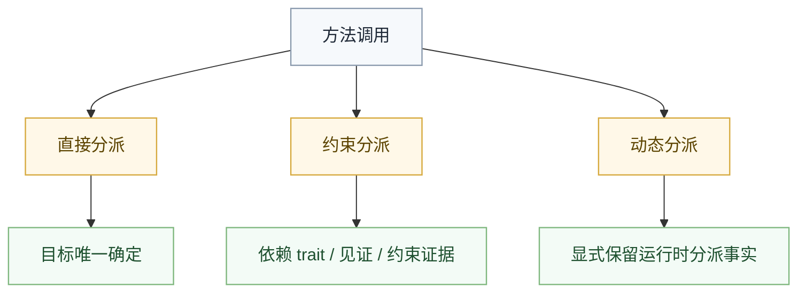

# 方法分派边界

## 概述

方法分派的核心任务，是在语义阶段把“这个调用到底指向谁”确定下来。后续阶段只能携带这个事实继续 lowering，不能重新猜。

## 在管线中的位置

分派归属在 `Semantics` 闭合，不属于后端职责。

## 需要回答的问题

每个方法调用至少要在语义阶段回答下面这些问题：

- 这是直接调用还是约束分派
- 调用目标绑定到了哪个定义
- 是否存在歧义
- 是否仍依赖动态分派事实

只要这里没有闭合，后续阶段就会被迫补做语言判断。

## 常见分派路线

### 直接分派

当调用目标已经唯一确定，且不依赖额外约束表时，分派可以视为直接分派。

### 约束分派

当调用依赖 `trait` 满足关系、见证信息或等价约束证据时，语义阶段需要把这件事明确记录下来。

### 动态分派

如果语言允许某类运行时分派，那么这里也必须明确标注“这是动态分派”，而不是把它伪装成普通静态调用。

## 歧义处理

维护时必须坚持一个原则：歧义在语义阶段报错，不要推迟。

典型歧义来源包括：

- 多个候选定义同样成立
- 多个约束都能提供同名能力
- 条件特化之间没有形成稳定偏序

这些情况都必须在这里给出明确诊断。

## 条件特化

当同名能力受约束条件控制时，语义阶段必须确定：

- 哪个候选更具体
- 哪些候选互相不可比较
- 当前调用是否足以决定唯一归属

如果无法唯一决定，就必须失败，而不是把选择权拖给后端。

## 与 `trait` 解析的关系

方法分派直接依赖 [trait-resolution.md](trait-resolution.md) 中已经闭合的满足关系。

顺序必须是：

1. 先闭合约束与满足关系。
2. 再决定方法调用归属。
3. 最后把分派事实写入 `HIR`。

## 与下游的关系

### 对 `HIR`

`HIR` 需要保留分派事实本身，例如：

- 这是直接分派
- 这是约束分派
- 这是动态分派

### 对 `MIR` 与后续 lowering

下游可以继续携带这些事实做分析、静态化和 family lowering，但不能重新判断调用归属。

## 动态分派边界

如果某类调用保留到运行时分派，文档里也必须坚持一个边界：

- 语义阶段只确认“需要运行时分派”这件事
- 具体如何承载，由各 family 自己决定
- 不能把某个单一 family 的实现机制抬升成语言统一事实

## 失败信号

只要出现下面任意一种情况，就说明分派边界正在坏掉：

- `HIR` 之后还在重新选方法目标
- family lowering 里还在判断某个调用属于哪种分派
- backend 里还在处理语言级歧义
- 为了某个 target 把分派模型硬改成全局统一低层结构

## 一句话原则

方法分派的结果必须在语义阶段闭合；后续阶段只允许消费这个结果，不允许重判。
