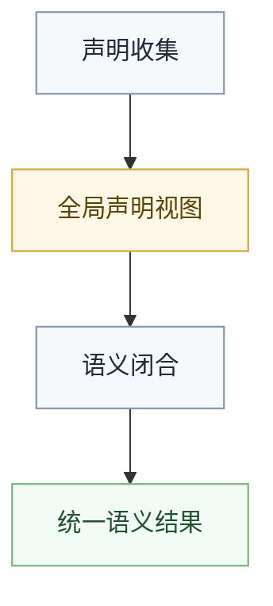

# 多文件语义边界

## 概述

多文件编译的关键，不是做一堆工作区服务名词，而是保证“跨文件语义仍然只闭合一次”。文件变多，不代表语义边界可以变散。

## 在管线中的位置

多文件能力本质上是对 `Semantics` 前置补充全局视图，而不是单独再发明一条平行编译管线。

## 两阶段模型

### 1. 声明收集

先建立全局声明视图，至少包括：

- 类型声明
- 约束声明
- 函数签名
- 模块边界
- 导入关系

这一步只负责收集，不负责把所有语义都做完。

### 2. 语义闭合

在全局视图稳定之后，再统一做：

- 类型绑定
- 约束解析
- 方法分派归属
- 效应检查
- 跨文件引用验证

## 为什么必须先收集再闭合

如果不先建立全局声明图，就会出现下面这些问题：

- 某个文件里的调用归属依赖另一个文件的声明
- `trait` 满足关系无法完整判断
- 导入顺序影响语义结果
- 同一项目内的错误信息变得不稳定

这会直接破坏语言语义的一致性。

## 依赖图与顺序

多文件场景需要稳定的依赖图，但依赖图只是辅助语义闭合，不是新的语言真相。

维护时应坚持：

- 先解析导入关系
- 再形成稳定分析顺序
- 最终输出统一语义结果

不能让“文件遍历顺序”偷偷决定语言含义。

## 循环依赖

循环依赖不是简单的工程问题，而是语义问题。处理时要区分：

- 仅声明层面的互相可见
- 需要完整定义才能成立的递归依赖

对于无法安全闭合的循环，必须给出明确诊断，而不是模糊放过。

## 跨文件约束与分派

多文件编译下，下面这些事实都必须仍然在语义阶段统一闭合：

- 某个类型是否满足某个 `trait`
- 某个调用最终绑定到哪里
- 某个导入路径是否有效
- 某个可见性边界是否被越过

这些都不应该拖到 `HIR` 之后再补。

## 增量编译

增量编译可以改变“重算哪些文件”，但不能改变“语义在哪里闭合”。

也就是说：

- 增量只是优化执行范围
- 语义边界仍然是同一条
- 任何缓存都不能让旧语义结果跨越新的全局依赖变化

## 与后续阶段的关系

一旦多文件语义闭合完成，后续阶段就应当只看到统一结果，而不是继续关心源文件是一个还是多个。

这保证：

- `HIR` 只消费稳定语义
- `MIR` 只做分析与优化
- family lowering 不再处理跨文件解析问题

## 失败信号

出现下面这些情况时，说明多文件边界开始坏掉：

- 文件遍历顺序影响最终语义
- `HIR` 之后还在补跨文件符号解析
- backend 还在处理导入或可见性问题
- 增量缓存绕过了应当重新闭合的全局依赖变化

## 一句话原则

多文件只是扩大了输入集合，没有改变语义闭合位置；所有跨文件事实仍然必须在前端统一确定。
