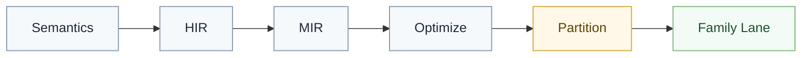
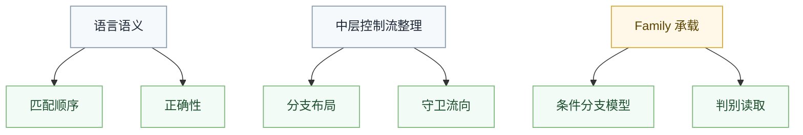

# 模式 lowering 边界

## 概述

本文关心的不是某个旧 lowering 节点名，而是模式匹配从高层语义进入低层控制流时，哪些边界必须保持稳定。

## 在管线中的位置

模式 lowering 发生在语义已经闭合之后，但仍然早于具体 family 编译。

## Lowering 之前必须已经确定的事

- 模式是否类型合法
- 变量绑定是否成立
- 穷尽性是否满足
- 守卫的求值条件和顺序

如果这些问题还没解决，就不应进入 lowering。

## Lowering 要做什么

模式 lowering 的职责是把高层模式结构整理成更接近控制流的表示，例如：

- 分支选择树
- 判别读取需求
- 解构顺序
- 跳转机会

它的目标是让模式成为可分析、可优化的控制流问题。

## Lowering 不该做什么

- 不该重新判定模式是否合法
- 不该补做穷尽性检查
- 不该决定某个 family 的最终编码格式
- 不该把某个后端的跳转模型强推成公共结构

## 跳转表与分支链

是否采用跳转表、条件链或其他布局，应该被视为中层与 family 的实现选择，而不是语言语义的一部分。

也就是说：

- 语言只关心匹配顺序和正确性
- 中层关心控制流整理
- family 关心如何承载这些控制流

## 与判别值的关系

模式 lowering 可以要求后续阶段拿到“某个变体的判别事实”，但不能提前把所有 family 的判别表示统一成一份物理格式。

这类事实应该保持在“需要什么信息”的层次，而不是“必须长成什么二进制形状”的层次。

## 与 family 的关系

进入 `Partition` 之后，后续 family 可以各自决定：

- 怎样承载条件分支
- 怎样读取判别事实
- 怎样实现守卫后的跳转

但它们都只能消费已经 lowering 完成的语义结果，不能重新定义匹配语义。

## 失败信号

下面这些现象说明模式 lowering 边界开始坏掉：

- 模式 lowering 里混入具体对象文件或字节码格式细节
- 为支持某个后端污染公共模式结构
- 后端里重新检查穷尽性或守卫语义
- 公共 lowering 强迫所有 family 接受同一份终态格式

## 一句话原则

模式 lowering 负责把已闭合的模式语义整理成可承载的控制流事实，但不负责重新定义语义，也不负责统一所有后端的终态表示。
