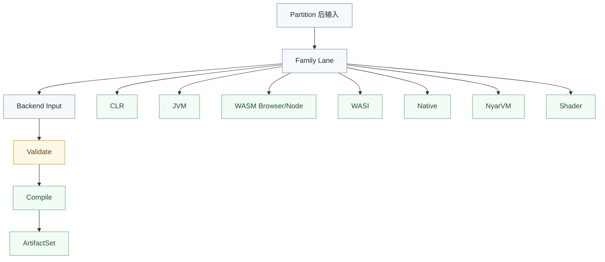

# 目标家族契约

本文定义 `valkyrie.v` 各 target family 的长期边界。它解决的不是“语义怎么写”，而是“哪类输入可以进入哪条路线、必须在何处失败、最终交付什么”。

## 总原则

所有 family 都必须满足以下规则：

- family 只消费自己的 `Backend Input`
- family 不重新解释语言语义
- family 必须先 `validate` 再 `compile`
- family 不支持的开放语义必须编译期硬失败
- family 的成功结果必须统一落到 `ArtifactSet`

## `NyarVM`

### 输入前提

- 允许保留相对丰富的运行时语义
- 允许承接更多解释型或虚拟机型低层操作

### 必须验证

- 字节码或模块结构是否自洽
- 入口是否满足运行时约定
- 运行时内建依赖是否完整

### 典型交付

- `.nyar`
- 调试符号
- 运行契约

## `CLR`

### 输入前提

- 必须已经闭合语言级语义
- 若当前路线不支持开放 witness 或开放 effect，则进入前必须静态化

### 必须验证

- 入口签名是否可映射到 `CLR` 入口规则
- metadata 引用是否完整
- 调用目标是否可稳定映射
- `CLR` 不支持的开放语义是否已清空

### 典型交付

- `.dll` 或 `.exe`
- `runtimeconfig`
- 调试资产
- 运行契约

## `JVM`

### 输入前提

- 进入前应已完成必要的静态化与调用闭合
- 不允许把未闭合语言语义伪装成普通静态调用

### 必须验证

- 类与方法签名是否合法
- 常量池引用是否完整
- 入口规则是否满足 `JVM` 宿主约束

### 典型交付

- `.class` 或 `.jar`
- launcher
- manifest
- 运行契约

## `WASM Browser/Node`

### 输入前提

- family 输入必须明确区分宿主是 `browser` 还是 `node`
- 语言语义已经闭合，宿主差异留到绑定和打包层

### 必须验证

- 导入导出是否满足宿主要求
- 线性内存、表和入口是否符合当前契约
- 宿主桥接是否完整

### 典型交付

- `.wasm`
- `.mjs` 或浏览器胶水
- 调试资产
- 运行契约

## `WASI`

### 输入前提

- family 输入必须明确区分 `WASI` 路线，而不是和 `browser/node` 混写
- 入口包装规则必须外显，不能混进通用 lowering

### 必须验证

- 是否满足 `WASI` 的入口与导入约束
- `Preview 1` 与 `Preview 2` 是否被明确区分
- 所需 sidecar 与运行说明是否完整

### 典型交付

- `.wasm`
- `wasmtime` 或其他宿主运行契约
- 必要 metadata

## `Native`

### 输入前提

- 必须是 native family 自己的低层输入
- 不要求经过文本汇编中间态
- 可以直接进入对象文件、可执行文件或机器码模型

### 必须验证

- 目标对象格式是否合法
- 调用约定、布局与平台 ABI 是否一致
- 当前架构与目标宿主是否匹配

### 典型交付

- `.obj`、`.exe`、`.dll`、`.so`、`.dylib` 等
- 调试符号
- 运行契约或链接说明

## `Shader` 预留

### 输入前提

- 应直接进入 shader family 自己的低层模型
- 不应借道 `CPU/VM` 导向兼容壳

### 必须验证

- 资源绑定是否完整
- 着色阶段约束是否满足
- 目标格式约束是否满足

### 典型交付

- `.spv`
- 平台专用 shader 产物
- 资源布局 metadata

## 统一失败策略

以下情况必须编译期硬失败：

- 输入不属于当前 family
- 当前 family 不支持的开放语义仍然残留
- 入口规则无法映射
- 宿主绑定缺失
- 格式校验前提不满足

## 一句话原则

`valkyrie.v` 不是“一个统一大 backend 去尽量适配所有 target”，而是“每个 target family 明确边界、明确输入、明确失败点、明确交付物”。
