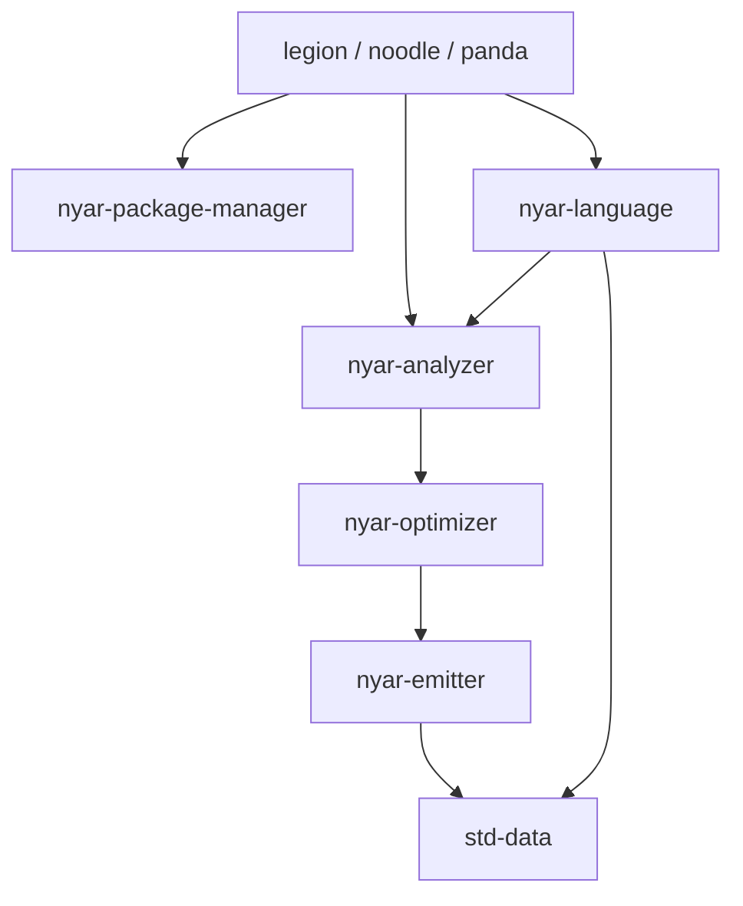

# 工具链架构边界

本文固定 **Legion / Noodle / Panda** 与中性核心的分工，避免产品身份或生态套壳回渗。

## 产品 vs 核心

| 层 | 职责 | 例子 |
|:---|:---|:---|
| **产品 CLI** | 生态清单翻译、布局适配、compat 参数、产品 home/lock 名 | `legion`、`noodle`、`panda` |
| **中性 PM** | 解析 / 安装 / 锁文件 / 发布流水线；经 `ProjectLayout` 注入文件名 | `nyar-package-manager` |
| **语言 + 分析** | 各语言 **具体** frontend / fmt / lint 实现 | `nyar-language`、`nyar-analyzer` |
| **优化** | 等式 / 静态化等共享优化 | `nyar-optimizer` |
| **驱动 / 数据** | 编译驱动与共享文本模型；lane 消费 `ExecutableModule` | `nyar-emitter`（crate 目录常称 `emitter`）、`std-data` |



## 硬约束

1. **Vite+ 只是形态参考**（统一入口 + 自带质量命令），不是身份，也不要求逐命令对齐。
2. **`fmt` / `lint` / `check` 必须自研**：`nyar-analyzer` 合约 + `nyar-language` 实现；产品只做路径/选项适配。禁止 `Command::new` 套壳 Biome / Prettier / ESLint / Ruff / Black 等。
3. **`nyar-package-manager` 保持中立**：不得内嵌 Legion / Noodle / Panda 产品概念，也不得把 npm / pnpm / pip / conda **包管理器身份**写进核心。注册表 id 字符串由产品选择，对 PM 应是不透明参数。
4. **compat 来自清单参数**（如 `package.json` 的 `noodle.compat` / `packageManager`，或 `[tool.panda] manager`），**禁止**靠外来 lockfile 嗅探选型。
5. **`~/.valkyrie`、`legion.von`、`legion-lock.von` 等是 Legion 产品默认**，经 `ProjectLayout` 注入；PM 中性默认是 `package.von` / `package-lock.von` / `.nyar`。
6. **crate / 包分层（同构）**：`nyar-language` → `nyar-analyzer` → `nyar-optimizer` → `nyar-emitter` → `std-data`。driver 不得反向依赖 language；VM 包只消费产物。中性输入类型写全称 **`ExecutableModule`**（禁止 `Exec` / `ExecModule`）。
7. **`nyar-language` 只放具体语言/框架实现**；禁止共享的 `host_script` 式抽象层（语言包各自具体，不要在 language 里抽通用 HostScript 合约）。禁止把 `body_source` / type-name 特判旁路写成正式架构。
## ScriptRunner 例外

`nyar-package-manager::ScriptRunner` 可以执行**用户**脚本（内部用 `cmd` / `sh`）。这不等于工具链自身去套壳 npm / uv / biome。

## 自动化守卫

| 位置 | 作用 |
|:---|:---|
| `noodle` / `panda` `src/architecture_guards.rs` | 扫描产品 `src`，禁止外国工具链 `Command::new("…")` |
| `nyar-package-manager` `layout` 内 architecture guards | 禁止产品 brand 字面量写死进 PM；中性 `ProjectLayout` |
| `nyar-language` `tests/architecture_guards.rs` | language → analyzer → optimizer → emitter；driver 不得反向依赖 language；禁止 `host_script` 共享抽象；具体语言目录不碰 Valkyrie MIR |

本地验证：

```bash
cargo test -p noodle --lib architecture_guards
cargo test -p panda --lib architecture_guards
cargo test -p nyar-package-manager --lib architecture_guards
cargo test -p nyar-language --test architecture_guards
```

## 相关页面

- [Noodle](noodle.md)
- [Panda](panda.md)
- [Legion](legion.md)
- 编译语义主线：[架构详解](../developer/architecture.md)
