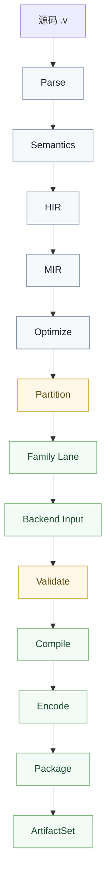

# VCC 编译器

VCC（Valkyrie Compiler Collection）是 Valkyrie 语言编译器，将 `.v` 源码编译为多种目标平台的交付产物。

## 命令行用法

```bash
vcc                       # 启动 REPL
vcc compile <file>        # 编译文件
vcc run <file>            # 编译并运行
vcc test <file>           # 运行测试
vcc repl                  # 交互式环境
vcc format <dir>          # 格式化代码
vcc check <dir>           # 运行代码检查
```

## REPL 交互式环境

```valkyrie
vcc> let x = 42
vcc> x + 1
43
vcc> micro greet(name) { println("Hello, {name}") }
vcc> greet("Valkyrie")
Hello, Valkyrie
```

## 编译流程



## 多后端代码生成

VCC 支持多种目标平台：

| 后端 | Vendor | 输出格式 | 适用场景 |
|:---|:---|:---|:---|
| NyarVM | unknown | `.nyar` 字节码 | 通用计算、开发调试 |
| WASM | unknown | `.wasm` | 浏览器前端、Edge 计算 |
| JVM | openjdk / android | `.class` | Java 生态集成 |
| CLR | microsoft / unity | `.dll` / `.exe` | 托管运行时生态集成 |
| Native | pc / apple | `.elf` / `.exe` / `.dylib` | 原生高性能 |

详细的目标三元组定义见[目标三元组规范](toolchain/target-triples.md)。

共享的是语义主线，不是统一终态低层模型。`Partition` 之后，`VCC` 负责把输入分流到各自 family 路线，再进入 `validate -> compile -> package`。

## 模块系统

### 导入模块

```valkyrie
using std.io
using game.physics
using package.module
```

### 模块路径解析

VCC 按以下顺序查找模块：

1. 当前文件所在目录
2. 项目根目录
3. `vendors/` 目录（非递归）
4. 全局 `vendors/` 目录

## vendors 不递归

`vendors/` 目录中的依赖不会递归查找其自身的 `vendors/`。每个包只看到自己直接声明的依赖。

## 配置传递

VCC 不直接读取配置文件。配置通过命令行参数和环境变量传递。

## 与 Legion 的协作

VCC 不知道 Legion 的存在。Legion 负责填充 `vendors/`，VCC 从 `vendors/` 读取依赖编译。两者通过 `vendors/` 目录解耦。


## 嵌入原则

下游工具如果要复用编译能力，应当依赖 `VCC` 暴露的编译契约，而不是绑定某个旧运行时对象接口。

长期稳定的嵌入边界应当是：

- 输入源集合
- 构建目标
- `ArtifactSet`
- 运行契约

这样才能避免外部工具反向依赖废弃内部实现。
