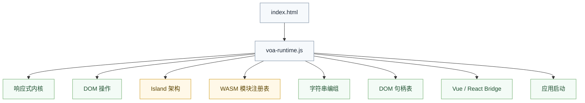
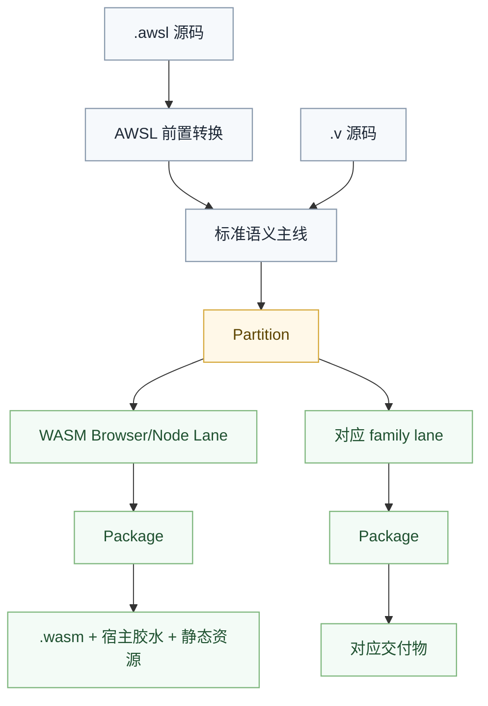

# VOA 全栈框架

VOA（Valkyrie of Asgard）是 Valkyrie 语言的全栈 Web 开发框架，灵感来自 Ruby on Rails 的"约定优于配置"哲学，定位类似 Next.js / Nuxt.js。

## 核心理念

| 原则 | 说明 |
|:---|:---|
| 约定优于配置 | 遵循命名约定即可自动生效，无需显式配置 |
| 前后端统一语言 | 前端进入 `WASM Browser/Node` 路线，后端进入 `CLR` / `JVM` / `Native` 等 family |
| 类型共享 | 数据类型只需定义一次，前后端共享 |
| 函数调用 | 前端直接调用后端函数，框架自动处理网络通信 |
| 项目导向 | 每个项目都是独立的 Valkyrie 包，管理自身依赖 |
| 语言主线复用 | 不自建平行编译器，复用 `valkyrie.v` 的语义主线与 family 分流 |

## 技术栈

| 层 | 技术 | 说明 |
|:---|:---|:---|
| 编译主线 | `valkyrie.v` 主编译线 | 复用语义闭合、family lowering 与交付体系 |
| 前端 | WASM | 编译目标为 WebAssembly + JS 胶水代码 |
| 后端 | CLR（优先） | 也可运行于 JVM、Native |
| UI | AWSL | `.awsl` 组件文件 |
| 脚本 | Valkyrie 语言 | `.v` 脚本文件 |
| 运行时 | `voa-runtime.js` | 唯一入口，按需加载 JS 胶水 + WASM |
| 包管理 | Legion | 依赖管理与构建工具 |
| 配置 | `voa.config.v` | 由 Legion 管理的项目配置 |

## 命令体系

| 命令 | 说明 |
|:---|:---|
| `voa dev` | 启动开发服务器 |
| `voa start` | 启动生产服务器 |
| `voa build` | 构建项目 |
| `voa add` | 添加依赖 |
| `voa remove` | 移除依赖 |
| `voa install` | 安装所有依赖 |
| `voa run` | 运行脚本 |
| `voa clean` | 清理构建产物 |
| `voa publish` | 发布包 |
| `voa new` | 创建新项目 |
| `voa check` | 类型检查与诊断 |
| `voa fmt` | 代码格式化 |
| `voa test` | 运行测试 |
| `voa init` | 初始化 VOA 项目 |
| `voa benchmark` | 性能基准测试 |
| `voa coverage` | 代码覆盖率收集 |

## 项目结构

```
my_workspace/
├── projects/
│   ├── project-1/             # 前端项目
│   │   ├── source/
│   │   │   ├── components/    # 组件
│   │   │   ├── pages/         # 页面
│   │   │   ├── services/      # 服务
│   │   │   └── models/        # 数据模型
│   │   ├── voa.config.v       # 项目配置
│   │   └── legion.von         # 包定义
│   ├── project-2/             # 后端项目
│   └── shared/                # 共享库
├── voa.workspace.v            # 工作区配置
└── legion.lock                # 依赖锁定
```

### 项目类型

| 类型 | 编译目标 | 说明 |
|:---|:---|:---|
| **前端项目** | `wasm` | 编译为 WebAssembly + JS 胶水代码 |
| **后端项目** | `clr` / `jvm` / `native` | 编译为对应平台字节码 |
| **共享项目** | `lib` | 编译为库，供其他项目依赖 |

## 运行时架构

`voa-runtime.js` 是 VOA 前端应用的**唯一必要脚本**，按需加载 WASM 模块和 JS 胶水：



## Island 架构

VOA 支持 **Hybrid Island** 架构，灵感来自 Astro，允许混合使用多种渲染模式：

| 岛屿类型 | 说明 | 适用场景 |
|:---|:---|:---|
| `static` | 纯静态 HTML，无 JS | 静态内容、文档 |
| `hydrated` | AWSL 组件，懒水化 | 交互组件 |
| `wasm` | WASM 重计算组件 | 复杂计算 |
| `vue` | Vue 3 生态组件 | 复用 Vue 库 |
| `react` | React 生态组件 | 复用 React 库 |

详见 [Island 架构](guides/island-architecture.md)。

## JS FFI 体系

Valkyrie 通过属性标注声明 JS 互操作：

| 属性 | 含义 | 示例 |
|:---|:---|:---|
| `[js_builtin("console.log")]` | 浏览器内置 API，零依赖 | `console.log` / `Math.floor` |
| `[js("axios", "get")]` | 第三方库，动态 `import()` | `axios.get` / `lodash.debounce` |
| `pure` | 纯函数标注，可被 DCE 删除 | `[js_builtin("Math.floor"), pure]` |

**关键区别**：
- `[js_builtin]`：零依赖，直接调用全局对象，胶水函数为同步
- `[js]`：需要 `import()` 加载第三方库，胶水函数为 `async`

详见 [JS FFI 体系](internals/js-ffi.md)。

## 编译架构



VOA 不实现自己的平行编译器。它只在主线之上增加：
- Web 相关前置转换
- Web 宿主约束
- 交付阶段的资源组织

## 配置

详见 [项目配置](guides/configuration.md)。

## 文档索引

- [AWSL 语言规范](language/extensions/awsl.md) — UI 声明语言语法详解
- [Island 架构](guides/island-architecture.md) — 混合渲染模式
- [运行时架构](internals/index.md) — 编译管线全景
- [JS FFI 体系](../maintainer/js-ffi.md) — 宿主绑定与打包边界
