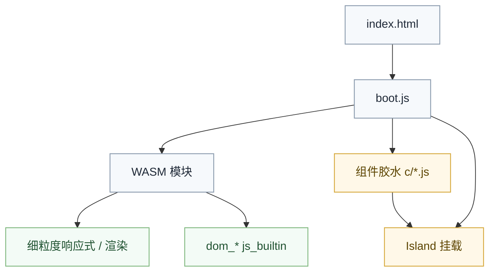
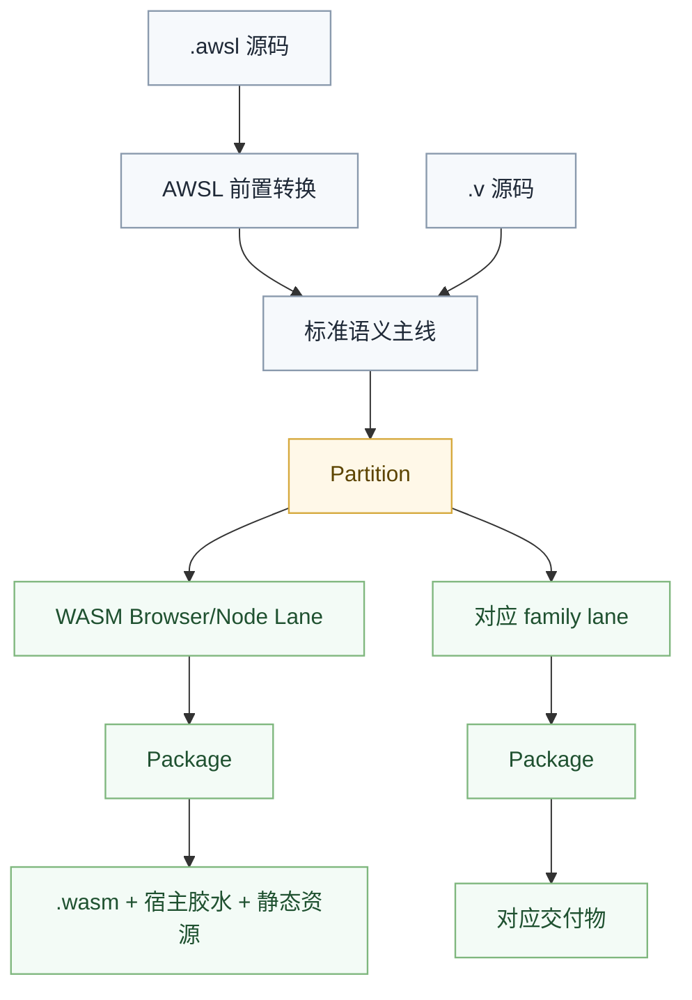

# Asgard CLI 与 VOA 编译实现

**Asgard** 是 GUI 应用框架，**用户 CLI 为 `asgard`**（`asgard build` / `asgard dev` / `asgard pack`）。底层编译由 Rust crate **`voa`** 实现（`cargo build -p voa --bin asgard`）。

| | Asgard（用户面） | VOA（实现） |
|:---|:---|:---|
| 角色 | 框架 + CLI 命令 | 编译管线（解析、降级、编译、写 dist） |
| 典型路径 | `valkyrie.v/projects/asgard/` | `valkyrie.rs/projects/voa/` |
| 用户配置 | 依赖 `asgard` / `asgard.ui` 等包 | `asgard.config.v` |

统一编译架构：[Asgard GUI 统一编译架构](../../projects/asgard/documentation/pages/zh-hans/architecture/gui-compilation.md)。UI 策略：[UI 渲染策略](../../projects/asgard/documentation/pages/zh-hans/architecture/ui-rendering.md)。

Asgard 采用约定优于配置，为应用提供类似 Next.js / Nuxt 的 **工程化构建体验**（约定目录、`asgard.config.v`）。**`asgard` 是独立 CLI**；`legion` 负责 V 包依赖与通用构建。

## 核心理念

| 原则 | 说明 |
|:---|:---|
| 约定优于配置 | 遵循命名约定即可自动生效，无需显式配置 |
| 前后端统一语言 | **Web** 走 WASM；**Android/iOS/小程序** 走各自宿主字节码（DEX / Mach-O / 宿主字节码） |
| 类型共享 | 数据类型只需定义一次，前后端共享 |
| 函数调用 | 前端直接调用后端函数，框架自动处理网络通信 |
| 项目导向 | 每个项目都是独立的 Valkyrie 包，管理自身依赖 |
| 语言主线复用 | 不自建平行编译器，复用 `valkyrie.v` 的语义主线与 family 分流 |

## 技术栈

| 层 | 技术 | 说明 |
|:---|:---|:---|
| 编译主线 | `valkyrie.v` 主编译线 | 复用语义闭合、family lowering 与交付体系 |
| 逻辑字节码 | **按 `platform`** | `browser` → WASM；`android` → DEX；`ios` → Mach-O；`wechat-miniprogram` → 宿主字节码 |
| UI | AWSL → RenderIR → **编入制品** | 各宿主原生视图消费（见 [UI 渲染策略](../guides/ui-rendering.md)） |
| 脚本 | Valkyrie 语言（后缀 `.v`，与语言名同一事物） | `.v` 源码文件 |
| Web 运行时 | `boot.js` + WASM | 仅 `platform: browser`；响应式在 WASM 内 |
| 包管理 | Legion | 依赖管理与构建工具 |
| 配置 | `asgard.config.v` | `platform` 选字节码后端；`build.mode` 控制 debug 侧车 |

## 命令体系

| 命令 | 说明 |
|:---|:---|
| `asgard dev` | 开发模式构建 + HMR 开发服务器（browser；监视 `source/` 变更并热重载） |
| `asgard build` | 生产构建 |
| `asgard pack` | 按 `publish` 组装交付物（apk / ipa / mini-program 等） |
| `asgard add` | 添加依赖（规划中） |
| `asgard remove` | 移除依赖（规划中） |
| `voa install` | 安装所有依赖 |
| `voa run` | 运行脚本 |
| `voa clean` | 清理构建产物 |
| `voa publish` | 发布包 |
| `voa new` | 创建新项目 |
| `voa check` | 类型检查与诊断 |
| `voa fmt` | 代码格式化 |
| `voa test` | 运行测试 |
| `voa init` | 初始化 VOA 项目 |
| `voa benchmark` | 性能基准测试 |
| `voa coverage` | 代码覆盖率收集 |

## 项目结构

```
my_workspace/
├── projects/
│   ├── project-1/             # 前端项目
│   │   ├── source/
│   │   │   ├── components/    # 组件
│   │   │   ├── pages/         # 页面
│   │   │   ├── services/      # 服务
│   │   │   └── models/        # 数据模型
│   │   ├── asgard.config.v       # 项目配置
│   │   └── legion.von         # 包定义
│   ├── project-2/             # 后端项目
│   └── shared/                # 共享库
├── voa.workspace.v            # 工作区配置
└── legion.lock                # 依赖锁定
```

### 项目类型

| 类型 | 编译目标 | 说明 |
|:---|:---|:---|
| **GUI 项目** | 按 `platform` | `browser` → WASM；移动/小程序 → 对应宿主字节码 |
| **后端项目** | `clr` / `jvm` / `native` | 编译为对应平台字节码 |
| **共享项目** | `lib` | 编译为库，供其他项目依赖 |

## 运行时架构（`platform: browser`）

**仅 Web** 走 WASM 路线。其它 `platform` 由宿主运行时加载 **制品内编入的 RenderIR** 与对应字节码（见 [统一编译架构](../guides/asgard-gui-compilation.md)）。

浏览器交付物为 **`boot.js`（加载器）+ WASM 模块 + 每路由 JS 胶水**。没有独立的 JS 框架 runtime；AWSL 的 `let mut` 响应式与渲染逻辑均在 WASM 中。



## Island 架构

VOA 支持 **Hybrid Island** 架构，灵感来自 Astro，允许混合使用多种渲染模式：

| 岛屿类型 | 说明 | 适用场景 |
|:---|:---|:---|
| `static` | 纯静态 HTML，无 JS | 静态内容、文档 |
| `hydrated` | AWSL 组件，懒水化 | 交互组件 |
| `wasm` | WASM 重计算组件 | 复杂计算 |
| `vue` | Vue 3 生态组件 | 复用 Vue 库 |
| `react` | React 生态组件 | 复用 React 库 |

详见 [Island 架构](guides/island-architecture.md)。

## JS FFI 体系

Valkyrie 通过属性标注声明 JS 互操作：

| 属性 | 含义 | 示例 |
|:---|:---|:---|
| `[js_builtin("console.log")]` | 浏览器内置 API，零依赖 | `console.log` / `Math.floor` |
| `[js("axios", "get")]` | 第三方库，动态 `import()` | `axios.get` / `lodash.debounce` |
| `pure` | 纯函数标注，可被 DCE 删除 | `[js_builtin("Math.floor"), pure]` |

**关键区别**：
- `[js_builtin]`：零依赖，直接调用全局对象，胶水函数为同步
- `[js]`：需要 `import()` 加载第三方库，胶水函数为 `async`

详见 [JS FFI 体系](internals/js-ffi.md)。

## 编译架构



VOA 不实现自己的平行编译器。它只在主线之上增加：
- Web 相关前置转换
- Web 宿主约束
- 交付阶段的资源组织

## 配置

详见 [项目配置](guides/configuration.md)。

## 文档索引

- [AWSL 语言规范](language/extensions/awsl.md) — UI 声明语言语法详解
- [Island 架构](guides/island-architecture.md) — 混合渲染模式
- [运行时架构](internals/index.md) — 编译管线全景
- [JS FFI 体系](../maintainer/js-ffi.md) — 宿主绑定与打包边界
