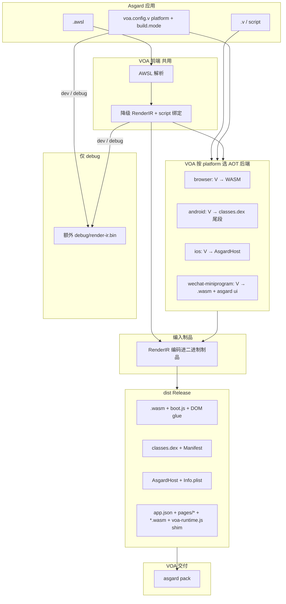

# Asgard GUI 统一编译架构

## 命名约定


| 名称         | 角色                                                                                      |
| ---------- | --------------------------------------------------------------------------------------- |
| **Asgard** | **GUI 应用框架 + 用户 CLI**（`asgard build` / `asgard dev` / `asgard pack`；widget、AWSL、运行时） |
| **VOA**    | **Rust 编译实现**（crate `voa`，`voa.config.v`；无独立 `voa` 可执行文件） |
| **AWSL**   | Asgard widget 的 `.awsl` 表面语法                                                            |


**框架与 CLI 都叫 Asgard。** Rust 端编译实现 crate 名为 **`voa`**（`cargo build -p voa --bin asgard`）；不存在 `asgard-wechat-*` 等额外 Rust 二进制。子项目用 Valkyrie 点分习惯（`asgard.ui`），不用 `asgard-ui` 指框架本体。

---

## 核心原则

0. **AOT 优先，禁止 VM on VM** — V 用户逻辑在各平台 **AOT 一次**；不得在 ART/JVM 等第二层 VM 上跑业务代码。详见 [AOT 原则](aot-principles.md)。
1. **单一平台制品** — 逻辑 + UI wire + 元数据 **编入该平台交付物尾段**；禁止 `ui.bin`、`host.bin`、`libasgard_host`（见 [AOT 原则](aot-principles.md)）。
2. **按宿主选 AOT 后端** — 各 `platform` 对应原生或 browser WASM。
3. **RenderIR 编入制品** — 模板降级得到的 RenderIR **编码进最终二进制**（逻辑包或宿主 UI 包内）；**Release 不单独散落 UI 中间文件**。
4. **Debug 多产物** — `build.mode: dev` 或开启 debug/sourcemap 时，**额外**写出 RenderIR 侧车（如 `debug/render-ir.bin`），便于检查与映射；**不算交付物**。
5. **平台原生优先** — 宿主用**原生**视图 shim 消费编入制品的 UI wire；`asgard.ui` V 源码**不**上设备。自渲仅小游戏等有限场景（见 [UI 渲染策略](ui-rendering.md)）。

---

## 总览




---

## 编译流水线

### 阶段 0 — 创作（Asgard）


| 输入                | 说明                                         |
| ----------------- | ------------------------------------------ |
| `.awsl`           | 声明式 UI（`Column` / `Text` / `Button`…）      |
| `<script>` / `.v` | 逻辑与 `let mut` 响应式                          |
| `voa.config.v`    | `platform` 选字节码后端；`build.mode` 控制 debug 侧车 |
| `legion.von`      | `target` 须与 `platform` 一致（见下表）             |


### 阶段 1 — 前端（VOA，全平台共用）

```
.awsl → 解析 → 模板降级 → RenderIR + script 绑定
```

- RenderIR 是 **VOA 内部 IR**（不进 Valkyrie HIR）。
- 此阶段 **不**决定 WASM/DEX/Mach-O；只产出可供各后端消费的 IR 与合成 V 片段。

### 阶段 2 — AOT 后端（按 `platform`）


| `platform`               | `target`（逻辑）            | 制品中的逻辑（AOT）                | UI / RenderIR                                                       |
| ------------------------ | ----------------------- | ------------------------ | ------------------------------------------------------------------- |
| `**browser`**            | `wasm32-*-browser-wasm` | `**.wasm`**（浏览器 AOT 模块）  | RenderIR → DOM 胶水；**IR 编入 WASM 制品元数据段 / 伴随 manifest**   |
| `**android`**            | `aarch64-linux-android` | **`classes.dex`**（尾段 `ASGARDNT` + asgard ui） | 同一 dex 制品；Compose 壳 class |
| `**ios`**                | `aarch64-apple-ios-`*   | **`AsgardHost`** Mach-O     | RenderIR **编入 Mach-O 尾段**                                        |
| `**wechat-miniprogram`** | `wasm32-unknown-miniprogram-wasm` | **`*.wasm`**（逻辑 AOT） | **asgard ui 尾段** + WXML 层；`voa-runtime.js` 薄 shim |
| `**wechat-minigame`**    | —                       | **不走本 UI 管线**            | Canvas 自渲（有限）；`legion build` + `asgard pack --target mini-game` |


要点：

- **禁止 VM on VM**：Android **不得**用 JVM DEX 承载用户 V 逻辑（见 [AOT 原则](aot-principles.md)）。
- **WASM** 用于 `platform: browser` 与 `wechat-miniprogram`（小程序 UI 仍为 WXML，非 DOM-in-WASM）。

### 阶段 3 — RenderIR 与制品的关系


| 构建模式                                             | RenderIR 去向                                                                          |
| ------------------------------------------------ | ------------------------------------------------------------------------------------ |
| **Release**（`build.mode: prod` 等）                | **仅**编码进二进制制品（DEX / Mach-O / WASM 附属段 / 宿主 UI 包）；dist 中 **无** 独立 `ui.bin` / 可读 IR 文件 |
| **Debug**（`build.mode: dev` 或 `build.sourcemap`） | 制品内 **仍** 含编码 IR；**另外** 写出 `debug/render-ir.bin`（或等价侧车）供工具链与调试器使用                    |


```text
Release:  [宿主二进制制品] ⊃ Encoded(RenderIR) ⊃ Encoded(逻辑)

Debug:    [宿主二进制制品] ⊃ Encoded(RenderIR)
          + debug/render-ir.bin   ← 仅调试，非交付
          + sourcemap（若开启）
```

首版实现若仍见独立 `ui.bin`，为 **旧 dist 兼容**；`asgard pack` 会打印废弃警告。

### 阶段 4 — Package（VOA → `dist/`）


| platform             | Release dist（二进制为主）                                      |
| -------------------- | -------------------------------------------------------- |
| `browser`            | `index.html`、`boot.js`、`**.wasm`**、组件胶水                  |
| `wechat-miniprogram` | `app.json`、`pages/`*（WXML/WXSS/JS）、**`*.wasm`**、`voa-runtime.js` shim |
| `android`            | `AndroidManifest.xml`、`**classes.dex`**（含逻辑 + 编入的 UI 描述） |
| `ios`                | `Info.plist`、**Mach-O 可执行**（含逻辑 + 编入的 UI 描述）             |


**不交付** Kotlin、Swift、Gradle/Xcode 源码。

### 阶段 5 — 交付（VOA）


| publish        | 命令                                      | 输入              |
| -------------- | --------------------------------------- | --------------- |
| `web-app`      | （浏览器直接加载 dist）                          | `dist/`         |
| `mini-program` | `asgard pack --target mini-program` | VOA dist        |
| `apk`          | `asgard pack --target apk`          | `dist/android/` |
| `ipa`          | `asgard pack --target ipa`          | `dist/ios/`     |
| `mini-game`    | `asgard pack --target mini-game`    | 非 VOA UI 管线     |


---

## 正交配置

```text
platform          target                      逻辑 AOT          RenderIR（Release）
──────────────────────────────────────────────────────────────────────────────────
browser           wasm32-*-browser-wasm       WASM module       编入 .wasm / manifest
android           aarch64-linux-android       classes.dex       尾段 ASGARDNT + asgard ui
ios               aarch64-apple-ios-*         AsgardHost        尾段
wechat-miniprogram  wasm32-unknown-miniprogram-wasm   *.wasm            尾段 asgard ui（无 ASGARDNT）
```

`publish` 只选 **VOA 哪条交付链**（`asgard pack --target …`），不改变字节码族。

---

## 仓库映射


| 概念                         | 路径                                    |
| -------------------------- | ------------------------------------- |
| VOA（Rust 唯一 GUI 工具） | `valkyrie.rs/projects/voa/` |
| 交付组装 | `voa/src/delivery/` |
| 宿主编译 | `voa/src/compile.rs` |
| RenderIR 降级 | `voa/src/awsl/lower.rs` |
| Web WASM 后端 | `voa/src/wasm.rs` |
| DEX / Mach-O 编码 | `std-data/src/binary/dex/`、`mach_o/` |
| Android/iOS Package | `voa/src/package/android/`、`ios/` |
| Asgard（V 框架；**无** Rust crate） | `valkyrie.v/projects/asgard/` |
| `asgard.ui` | `valkyrie.v/projects/asgard.ui/`（**契约**；设备侧由原生 shim 实现） |


---

## 实现状态（文档 vs 代码）


| 项 | 目标架构 | 当前实现 |
|:---|:---|:---|
| 单一平台制品 | 无侧车 bin/so | **已实现** — dex / Mach-O / voa-runtime.js |
| RenderIR 尾段嵌入 | Release 无 ui.bin | **已实现** |
| Android | `classes.dex` | **已实现** |
| 小程序 | `*.wasm` + asgard ui | **已实现** |

---

## Asgard UI v1 Wire 格式

与 [`voa/src/codegen/mobile_ui_binary.rs`](../../../../../../valkyrie.rs/projects/voa/src/codegen/mobile_ui_binary.rs) 及 `asgard.ui` 解码器对齐：

```text
文件 / 嵌入段:
  magic[7]     = Asgard UI wire v1（7 字节标签 + 0x01）
  u32          = payload 字节长度（仅嵌入段有此长度前缀；包本体无）
  payload      = UiPackage

UiPackage:
  magic[7]     = Asgard UI wire v1（7 字节标签 + 0x01）
  u32          = component_count
  repeat component_count:
    string     route_name
    string     component_name
    Bindings[]
    RenderIr[]

Bindings:
  u32 count
  repeat:
    string name
    string init_expr
    u8 reactive
    u8 value_type   # 1=i32, 2=utf8, 3=bool

RenderIr node:
  u8 kind         # 1=Tag, 2=Text, 3=If, 4=Loop
  Tag: string tag, u8 node_kind, Attrs[], children[]
  Text: TextParts[]
  If: string cond, then[], else[]
  Loop: string items, string item_var, body[]

Attr:
  string name, u8 is_event, u8 is_prop, u8 value_kind
  value_kind 1/2: string; 3: TextParts[]
```

**嵌入规则**：在**平台唯一制品**尾段追加 `ASGARDNT`（native AOT）与 asgard ui wire（魔数 `ASGARDUI`）；`find_asgard_ui_section` 取最后一段 UI 匹配。禁止额外 `ui.bin`、`host.bin`、`libasgard_host`。


---

## 相关文档

- [UI 渲染策略](ui-rendering.md)
- [项目配置](../configuration.md)
- [VOA 工具](../../../../documentation/pages/zh-hans/toolchain/voa.md)
- [目标三元组与 publish](../../../../documentation/pages/zh-hans/developer/target-triples.md)

