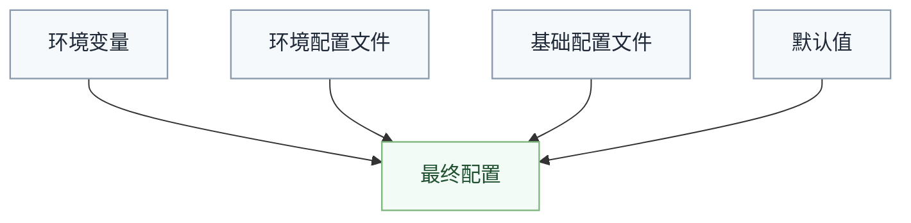

# 项目配置

Asgard 应用采用约定优于配置；**`asgard` CLI** 读取项目根目录的 **`asgard.config.v`** 决定编译与 Package 行为。详见 [Asgard GUI 统一编译架构](architecture/gui-compilation.md)。

## asgard.config.v

配置文件为 **Valkyrie script**，**必须**使用 **`define_config(asgard) { ... }`** 块（Rust / JetBrains / VSCode 均据此提供字段自动补全）。**不支持**根级 `{ key: value }` 简写，**不是 TOML**，也**不是** `legion.von` 数据格式。

```v
define_config(asgard) {
    project_type = "application"
    target = "wasm32-unknown-browser-wasm"
    platform = "browser"
    name = "my-app"
    version = "0.1.0"

    build {
        mode = "prod"
        output = "dist"
        minify = true
        sourcemap = false
        chunk {
            js_mode = "per-component"
            css_mode = "merged"
        }
    }

    language {
        awsl {
            strict_mode = false
            allow_template_tag = true
        }
    }

    hot_reload {
        enabled = true
        watch = ["source/", "assets/"]
        ignore = [".git/", "node_modules/"]
        debounce = 100
        port = 3000
    }

    ui {
        themes = [
            { id = "fate", label = "Fate" }
        ]
        modes = [
            { id = "light", label = "Light" }
        ]
    }

    tailwind {
        enabled = false
        entry = "source/styles/global.aws"
        config = "tailwind.config.js"
    }
}
```

> `tailwind.enabled` 默认为 `false`：构建时仅写出 `dist/.asgard/tailwind-content.txt`（从 `@style` 静态收集的 utility class）。设为 `true` 且本机有 Node/`npx tailwindcss` 时，才会调用 Tailwind CLI 并将产出 CSS 合并进 dist。

## 项目类型

| 值 | 说明 | 编译目标 |
|:---|:---|:---|
| `application` / `frontend` | Asgard GUI 应用 | 由 `platform` 决定 |
| `library` | 共享库（无宿主配置） | `lib` |

> **后端 / Atlas**：使用 `atlas.config.von` 与 Atlas 流水线，**不要**给 API 包写 `asgard.config.v`。全栈金样例见 `examples/test.fullstack`（`apps/shell` ∥ `apps/atlas` + `packages/domain`）。部署拓扑见 [Deploy Profile](architecture/deploy-profiles.md)。

## 编译目标

目标使用**目标三元组**（Target Triple）格式：`arch-vendor-os[-abi]`，完整定义见[目标三元组规范](../toolchain/target-triples.md)。

| 目标三元组 | 说明 | 用途 |
|:---|:---|:---|
| `wasm32-unknown-browser` | WebAssembly（浏览器） | 前端（默认） |
| `wasm32-unknown-node` | WebAssembly（Node.js） | 服务器侧 JS 宿主 |
| `wasm32-unknown-deno` | WebAssembly（Deno） | Deno 宿主 |
| `wasm32-unknown-bun` | WebAssembly（Bun） | Bun 宿主 |
| `clr-microsoft-windows` | `CLR` 托管执行（Windows） | 后端（优先） |
| `clr-unity-windows-il2cpp` | `CLR` 托管执行（Unity IL2CPP） | Unity |
| `jvm-openjdk-linux` | `JVM` 托管执行 | 后端（可选） |
| `x86_64-unknown-linux-gnu` | 原生二进制（Linux） | 后端（可选） |
| `lib` | 库 | 共享依赖 |

配置示例：

```v
target = "wasm32-unknown-browser"    // 前端
target = "clr-microsoft-windows" // 后端
target = "clr-unity-windows-il2cpp" // Unity
```

## 宿主平台（platform）

> UI 总策略：**[平台原生优先，自渲有限支持](ui-rendering.md)**。`platform` 决定 Package 阶段交付物（与 `target` 正交）。

`asgard.config.v` 的 `platform` 字段控制 **Package 阶段**交付物形态（与 `target` 正交）：

| platform | 产物 | 说明 |
|:---|:---|:---|
| `browser`（默认） | `index.html` + `boot.js` + **`.wasm`** | WASM AOT；RenderIR 编入制品 |
| `wechat-miniprogram` | `app.json` + `pages/*` + **`.wasm`** + shim | WASM 逻辑 + asgard ui；WXML setData |
| `wechat-minigame` | **不走 VOA UI** | Canvas 自渲（有限） |
| `android` | **`classes.dex`** + Manifest | V→DEX；IR 编入 dex |
| `ios` | **Mach-O** + `Info.plist` | V→Mach-O；IR 编入可执行文件 |

`build.mode: dev` 或 `build.sourcemap` 时，可 **额外** 生成 `debug/render-ir.bin` 等调试侧车（非 Release 交付）。

发布格式（`legion.von` 的 `build[].publish`）与 SDK 注入：

| publish | 隐式 SDK |
|:---|:---|
| `web-app` | （浏览器适配器，按 target） |
| `mini-game` | `tencent.wechat.sdk` |
| `mini-program` | `tencent.wechat.miniprogram.sdk` |
| `apk` | （首版无隐式 SDK；完整 V→DEX 后续） |
| `ipa` | （首版无隐式 SDK；完整 V→Mach-O 后续） |

详见 [UI 渲染策略](ui-rendering.md)、[微信小程序指南](wechat-miniprogram.md)、[Android APK 指南](android-apk.md)、[iOS IPA 指南](ios-ipa.md)。

## UI 注册表

`ui.themes` / `ui.modes` 用来声明 **Asgard UI** 可用的 theme / mode 注册表。`ThemeShell`、`ThemeSwitcher` 等主题组件应消费这个注册表，而不是在组件源码里手写 `if / else` 穷举。

```v
{
    ui: {
        themes: [
            { id: "aether", label: "Aether" },
            { id: "fate", label: "Fate" }
        ],
        modes: [
            { id: "auto", label: "Auto" },
            { id: "light", label: "Light" },
            { id: "night", label: "Night" }
        ]
    }
}
```

工具链优化规则：

| 条件 | 工具行为 |
|:---|:---|
| `ui.themes.len == 1` | `ThemeShell.theme` 折叠为静态常量 |
| `ui.modes.len == 1` | `ThemeShell.mode` 折叠为静态常量 |
| `ui.themes.len == 1 && ui.modes.len == 1` | `ThemeShell` 直接内联为普通容器节点；`ThemeSwitcher` 从 RenderIR 中删除 |

## 环境覆盖

```
asgard.config.v              # 基础配置
asgard.config.development.v  # 开发环境
asgard.config.test.v         # 测试环境
asgard.config.production.v   # 生产环境
```

## 环境变量

配置值可通过环境变量覆盖：

| 环境变量 | 对应配置 |
|:---|:---|
| `VOA_PROJECT_TYPE` | `project_type` |
| `VOA_TARGET` | `target` |
| `VOA_SERVER_PORT` | `server.port` |
| `VOA_SERVER_HOST` | `server.host` |
| `VOA_BUILD_OUTPUT` | `build.output` |
| `VOA_ENV` | 当前环境 |

优先级：环境变量 > 环境配置文件 > 基础配置 > 默认值。



## 全栈示例

### 前端

```v
define_config(asgard) {
    project_type = "application"
    target = "wasm32-unknown-browser-wasm"
    platform = "browser"
    build {
        output = "dist"
        minify = true
        sourcemap = true
    }
    hot_reload {
        enabled = true
        watch = ["source/"]
    }
}
```

### 后端

```v
define_config(asgard) {
    project_type = "backend"
    target = "clr"
    server {
        host = "0.0.0.0"
        port = 8080
        workers = 4
    }
    build {
        output = "bin"
        minify = true
        sourcemap = false
    }
}
```

### 共享库

```v
define_config(asgard) {
    project_type = "library"
    target = "lib"
    build {
        output = "lib"
        minify = true
        sourcemap = false
    }
}
```
