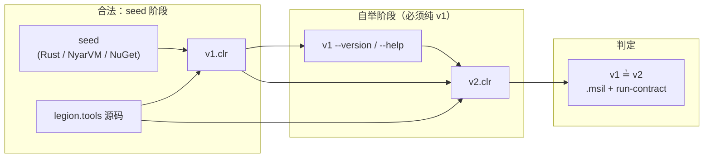
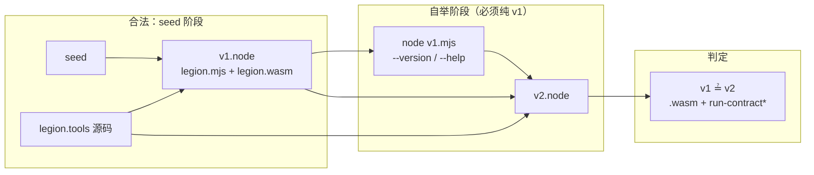
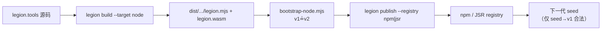

# 编译器自举契约（bootstrap-contract）

## 1. 目的

本文档定义 **Level 2（L2）编译器自举** 的验收边界，用于区分 **真自举** 与 **假自举**。

自举目标项目固定为 `valkyrie.v/projects/legion._/projects/legion.tools`（Valkyrie 重写的 `legion` CLI / 编译器前端）。

正式同构编译主线（与 Rust seed 对齐）为：

```text
nyar.language → nyar.analyzer → nyar.optimizer → nyar.emitter
```

Valkyrie 前端在 `nyar.language` 内完成 AST→HIR→MIR，再适配为中性 **`ExecutableModule`**（以及 `ExecutableFunction` / `ExecutableBlock` / `ExecutableInstruction`），由 `nyar.emitter` 各 lane 消费。`nyar.vm.*` 只消费产物，不得依赖 `nyar.language`。

**禁止**把下列旁路写成正式架构或「已完成同构自举」：`clr_body_lowering` / `body_source→MSIL`、按 type-name 特判直出 MSIL、或跳过 analyzer/optimizer/emitter 的临时降级路径。

L2 采用 **四目标反作弊联合验收**，共享同一源码与模块系统前置门：

| 轨 | 目标 | 产物形态 | 验收脚本 | profile |
|:---|:---|:---|:---|:---|
| **CLR** | `clr` → `clr-microsoft-unknown-managed` | `legion.exe` + `.msil` | `bootstrap-clr.mjs` | L2 七门 |
| **JVM** | `jvm` → `jvm-openjdk-unknown-managed` | `legion.jar` | `bootstrap-jvm.mjs` | L2 七门 |
| **Node** | `node` → `wasm32-node-unknown-wasm` | `legion.mjs` + `legion.wasm` | `bootstrap-node.mjs` | L2 七门 |
| **WASI** | `wasi` → `wasm32-unknown-wasi-wasi` | `legion.wasi` | `bootstrap-wasi-witness.mjs` | witness 六门 |

任何声称「已完成 L2 自举」的结论，必须在 **四目标月度矩阵**（`monthly-matrix.mjs`）上同时满足对应 profile；**stub、bridge、跳过比对、跳过 v1→v2 一律算整组失败**。

> 汇总：`node scripts/monthly-matrix.mjs`  
> 反作弊：`node scripts/check-bootstrap-integrity.mjs`  
> Runtime 矩阵：`node scripts/run-runtime-matrix.mjs`

---

## 2. 术语

| 术语 | 含义 |
|:---|:---|
| **seed** | 上一代可运行编译器（Rust `legion`、NyarVM.cs / NuGet 等）。**仅允许**用于 `源码 → v1`。 |
| **v1** | CLR 轨：`legion.exe` + `.msil`；Node 轨：`legion.mjs` + `legion.wasm`。 |
| **v2** | 用 **v1 自身** 再次编译同一份 `legion.tools` 源码得到的同轨产物。 |
| **真自举** | v1 能作为完整编译器运行 `legion build`，且 v2 与 v1 在契约规定的产物上 **一致**。 |
| **假自举** | 任一阶段由外部宿主代劳、跳过门禁、或把「能跑出 demo」当成「已完成自举」。 |

### 2.1 阶段划分（不可混淆）



**硬规则**：

1. **seed 只出现一次**——从 `源码 → v1`。
2. **`v1 → v2` 必须由 v1 进程内的编译管线完成**（`legion build` / `emitter_compile_project`），禁止 Rust/C# driver、HostBridge、环境变量委托。
3. **任一门禁未通过 → 整体失败**（非零退出码），不得把「跳过」记为「通过」。

### 2.2 Node（WASM）轨阶段划分



Node 轨 **禁止** 用浏览器 `wasm` 三元组（`wasm32-unknown-browser-wasm`）冒充 Node 自举；CLI 分发必须使用 **`--target node`**（canonical：`wasm32-node-unknown-wasm`）。

---

## 3. 假自举清单（禁止项）

以下模式一经发现，**不得**宣称 L2 通过，也 **不得**合并到发布门：

| # | 假自举模式 | 为何无效 |
|:-:|:---|:---|
| 1 | **HostBridge / `LEGION_SEED` 委托** | v1 的 `build` 实际由 Rust/C# 宿主执行，v1 只是壳。 |
| 2 | **`projects/micro_compiler` 作弊工程** | 用极简替身项目冒充 `legion.tools` 完成 v1→v2。 |
| 3 | **复制 seed 二进制为 v1/v2** | 未经过源码编译，比对无意义。 |
| 4 | **v1 硬编码输出、不读源文件** | WASM 链要求传入真实 `source/main.v`；CLR 要求 `legion build` 收集项目闭包。 |
| 5 | **仅验收 `--version` / `--help` 字符串** | CLI 壳可由宿主注入；必须能 `build` 同项目或 smoke 切片。 |
| 6 | **跳过 v1→v2 或跳过比对仍报成功** | `bootstrap-clr.mjs` 对跳过项返回失败。 |
| 7 | **用 Rust seed 完成 v2 编译** | 破坏自举定义；v2 只能来自 v1。 |
| 8 | **实验脚本替代正式验收轨** | `scripts/experimental/*` 不计入发布门；须用 `bootstrap-clr.mjs` / `bootstrap-node.mjs`。 |
| 9 | **registry 依赖替代 workspace 成员** | 自举链上的 `nyar` / `std` 必须解析到本地 workspace，避免拉到未知远程包。 |
| 10 | **把 smoke 切片当成完整 L2** | `examples/bootstrap-smoke` 只验证 v1 能编译最小夹具；完整 L2 仍要 `legion.tools` v1→v2。 |
| 11 | **`--target wasm`（浏览器）冒充 Node 轨** | npm/JSR CLI 须 `--target node`（`wasm32-node-unknown-wasm`），不是 `wasm32-unknown-browser-wasm`。 |
| 12 | **产物仍名 `legion_tools.*`** | Node 轨入口契约要求 `legion.mjs` + `legion.wasm`；旧分区名不算通过。 |
| 13 | **npm/jsr 包顶替 workspace 做验收** | 公开发布包可作下游 seed，不能在同一轮自举里替换 `nyar`/`std` workspace 成员。 |
| 14 | **`body_source` / `clr_body_lowering` 旁路冒充正自举** | 正式路径是 `MirModule`→`ExecutableModule`→`nyar.emitter`；旁路不得记为架构完成。 |
| 15 | **type-name 特判直出 MSIL / classfile** | 特判 emit 不是同构管线；不得写成正式 lowering。 |

已移除/禁止的遗留路径：

- `micro_compiler` 目录与 workspace 成员引用
- `valkyrie-wasi-host` 源文件驱动链（WASI `.wasi` / component seed 再编译）
- 任何「编译退出码 0 但未产出约定 artifact」的静默通过

---

## 4. 模块系统前置门

在 `seed → v1` 之前，`bootstrap-clr.mjs` 与 `bootstrap-node.mjs` 均通过 `scripts/bootstrap-lib.mjs` 执行 **模块系统前置门**（`validateModuleSystem`）。未通过则 **不执行** 后续编译。

### 4.1 必要文件

| 路径 | 要求 |
|:---|:---|
| `valkyrie.v/legions.von` | 超 workspace 清单存在（嵌套成员含 `projects/legion._`、`projects/nyar._` 等） |
| `projects/legion._/projects/legion.tools/legion.von` | `name: "legion.tools"` |
| `projects/nyar._/projects/nyar/legion.von` | `name: "nyar"` |
| `projects/std/legion.von` | `name: "std"` |
| `projects/legion._/projects/legion.tools/source/build_context.v` | 显式 `using nyar;` 与目标解析辅助函数 |

### 4.2 `legion.tools` manifest 契约

```von
{
    name: "legion.tools",
    auto_link: {
        core: true,
        std: false
    },
    dependencies: {
        "nyar": { version: "workspace" },
        "std": { version: "workspace" },
        "std.data.text.von": { version: "workspace" }
    },
    build: [
        { target: "clr" },
        { target: "node", msil: false }
    ]
}
```

`node` 目标用于 npm / JSR 分发轨；CLR 目标用于 NuGet / .NET 工具链。两条轨可共用同一份源码，但验收脚本与比对产物不同。

要点：

- **`auto_link.std` 必须为 `false`**——标准库通过显式 workspace 依赖引入，避免隐式解析歧义。
- **`nyar` / `std` / `std.data.text.von` 必须使用 `version: "workspace"`**（或 `source: "workspace"`），强制走本地成员，禁止自举链上静默回落 registry。

### 4.3 超 workspace 成员

根 `legions.von` 必须 **显式包含**（直接或嵌套展开后可达）：

- `projects/legion._`（其 `legions.von` 含 `projects/legion.tools`、`projects/legion.report`）
- `projects/nyar._`（其 `legions.von` 含 `nyar` / `nyar.analyzer` / `nyar.optimizer` / `nyar.emitter` / `nyar.language` 等）
- `projects/std`
- `examples/test.module_system`

包物理路径：`projects/legion._/projects/legion.tools`、`projects/nyar._/projects/nyar` 等。

**不得**再包含 `projects/micro_compiler`，也不得把已归位的包写回顶层 `projects/legion.tools` / `projects/legion.report`。

### 4.4 `build_context.v` 契约片段

须包含以下可检索符号（用于证明跨模块类型解析走显式 import，而非宿主注入）：

- `using nyar;`
- `micro legion_parse_canonical_target(target: utf8) -> CanonicalTarget {`
- `return parse_target(canonical)`
- `return format_target(parsed)`
- `return default_target()`

---

## 5. `legions.von` / `legion.von` 与自举

自举不是独立工具链，而是建立在 **workspace 发现 + 依赖闭包** 之上。

### 5.1 两级 workspace

| 层级 | 文件 | 作用 |
|:---|:---|:---|
| 超 workspace | `valkyrie.v/legions.von` | 嵌套引用 `asgard._` / `nyar._` / `legion._` 等分发入口 |
| 子 workspace | 如 `projects/legion._/legions.von` | 单独开发 `legion.tools` 等工具包 |

Legion planner 会 **递归展开** 嵌套 `legions.von`，并为成员路径建立 **basename 别名**（`projects/core` → `core`）。

### 5.2 依赖源策略（`source` 字段）

`legion.von` `dependencies` 支持：

| `source` | 行为 |
|:---|:---|
| *(省略，Auto)* | workspace 成员命中 → 本地；否则有 `version` → registry |
| `"workspace"` | 强制本地；成员缺失 → **错误** |
| `"registry"` | 强制远程；必须提供 `version` |

**自举链约束**：`legion.tools` 对其编译器核心依赖（`nyar`、`std` 等）应使用 **workspace 源**，确保 v1/v2 编译时读到的是仓库内同一份源码，而非 `vendors/` 里未知版本的远程包。

可选字段 `registry`（默认 `"npm"`）仅在对第三方包使用 `source: "registry"` 时生效。

### 5.3 源码闭包

`legion build` 规划器会：

1. 解析 `auto_link` + 显式 `dependencies` + 平台隐式 SDK；
2. 按依赖源收集 **传递闭包**（workspace 递归 + registry vendor 递归）；
3. 合并所有 `.v` 源文件供编译器做单次语义分析。

自举验收隐含要求：**v1 的闭包解析结果与 seed 阶段一致**（同一 `legions.von` 成员表），否则 v1/v2 MSIL 不可比。

---

## 6. 门级验收

### 6.1 CLR 轨（NuGet / .NET 发布门）

`bootstrap-clr.mjs` 输出门级状态；**全部通过** 才允许宣称 CLR L2 验收成功。

| 门 | 通过条件 | 失败时 |
|:---|:---|:---|
| 模块系统前置门 | §4 全部满足 | 跳过 seed→v1 及之后所有门 |
| 上一代编译器入口 | `--legion` / `LEGION_PATH` / 自动构建 NyarVM.cs | 非零退出 |
| 源码 → v1.clr | `seed build projects/legion._/projects/legion.tools --target clr` 产出 CLI | 非零退出 |
| v1 `--version` | `dotnet exec v1 --version` 退出码 0 | 阻断 v1→v2 |
| v1 `--help` | `dotnet exec v1 --help` 退出码 0 | 阻断 v1→v2 |
| v1 → v2.clr | **仅** `dotnet exec v1 build ...` | 非零退出 |
| v1 / v2 比对 | 见 §7.1 | 非零退出 |

报告：`dist/bootstrap-clr/bootstrap-report.json`。

### 6.2 Node 轨（npm / JSR 发布门）

`bootstrap-node.mjs` 与 CLR 轨共享模块系统前置门，但产物与运行方式不同：

| 门 | 通过条件 | 失败时 |
|:---|:---|:---|
| 模块系统前置门 | §4 全部满足 | 跳过 seed→v1 及之后所有门 |
| 上一代编译器入口 | 同 CLR 轨 seed 解析 | 非零退出 |
| 源码 → v1.node | `seed build ... --target node` 产出 `legion.mjs` + `legion.wasm` | 非零退出 |
| v1 入口契约 | 产物名为 `legion.*`，**不得** 仍为 `legion_tools.*` | 阻断运行验收 |
| v1 `--version` | `node legion.mjs --version` 退出码 0 | 阻断 v1→v2 |
| v1 `--help` | `node legion.mjs --help` 退出码 0 | 阻断 v1→v2 |
| v1 → v2.node | **仅** `node v1.mjs build ... --target node` | 非零退出 |
| v1 / v2 比对 | 见 §7.4 | 非零退出 |

报告：`dist/bootstrap-node/bootstrap-report.json`。

> Node 轨与 CLR 轨并列接入 CI（`bootstrap.yml`）；**Node job 失败阻断 npm / JSR 公开发布**，CLR job 失败阻断 NuGet。

### 6.3 Smoke 切片（非完整 L2）

`node scripts/bootstrap-smoke-clr.mjs` 验收：

1. seed → v1（`legion.tools`）
2. v1 编译 `examples/bootstrap-smoke`
3. 校验 `main.exe` / `main.msil` / `run-contracts.txt`

**通过 smoke 不等于 L2 完成**；完整 L2 仍以 `bootstrap-clr.mjs` 的 v1→v2 + MSIL 比对为准。

---

## 7. v1 / v2 比对规则

### 7.1 CLR 轨：必须一致

| 产物 | 说明 |
|:---|:---|
| 所有 `.msil` 文件 | 核心 IL；自举一致性的 **主判定依据** |
| `run-contract.txt` 或 `run-contracts.txt` | 运行契约；必须字节一致 |

比对方式：按文件名对齐后 SHA-256；`.msil` 清单结构不同（多/少文件）亦阻断。

### 7.2 CLR 轨：允许差异

| 产物 | 原因 |
|:---|:---|
| `.exe` / `.dll` | PE 含 MVID、时间戳等非确定性元数据 |
| `.pdb` | 调试符号路径/时间戳 |
| `.runtimeconfig.json` / `.deps.json` | SDK 版本与解析顺序差异 |

### 7.3 Rust `legion bootstrap` 比对

`legion bootstrap` 在 CLR 目标上优先比对 `run-contract.txt`；若不存在则回退到 CLI 入口 PE 字节比对（适用于极小 smoke 项目）。

完整 `legion.tools` CLR 验收以 `bootstrap-clr.mjs` 的 **MSIL 目录哈希** 为准。

### 7.4 Node 轨：必须一致

| 产物 | 说明 |
|:---|:---|
| 所有 `.wasm` 文件 | Node 宿主 WASM 模块；自举一致性的 **主判定依据** |
| `run-contract.txt` / `run-contracts.txt` | 运行契约；必须字节一致 |

### 7.5 Node 轨：允许差异

| 产物 | 原因 |
|:---|:---|
| `.mjs` | Node 胶水可能随宿主装配策略调整 |
| `.json` | 元数据/清单非确定性 |

**禁止** 因 `.mjs` 差异而跳过 `.wasm` 比对。

---

## 8. npm / JSR 发布策略（Node 轨）

Valkyrie 的 **主要 JavaScript 生态发布平台** 为 **npm** 与 **JSR**。NuGet 继续服务 CLR 轨；二者不互相替代。

### 8.1 平台分工

| 平台 | 典型用途 | `legion.von` 配置 | 安装 |
|:---|:---|:---|:---|
| **npm** | CLI 工具、`legion` 可执行分发、`@scope/pkg` 库 | `publish: [{ target: "node", type: "npm", package_id: "@valkyrie-language/legion", version: "…" }]` | `npm i -g @valkyrie-language/legion` |
| **JSR** | 模块化库、TypeScript 友好包、标准库切片 | `publish: [{ target: "node", type: "jsr", package_id: "@valkyrie/std", version: "…" }]` | `jsr add @valkyrie/std` |
| NuGet | CLR 轨 `legion` 工具 | `type: "nuget"` | `dotnet tool install` |

### 8.2 `publishConfig` 与默认 registry

```von
{
    name: "legion.tools",
    publishConfig: {
        registry: "npm",
        access: "public",
        tag: "latest"
    },
    publish: [
        {
            target: "node",
            type: "npm",
            package_id: "@valkyrie-language/legion",
            version: "0.1.0"
        },
        {
            target: "node",
            type: "jsr",
            package_id: "@valkyrie/legion-tools",
            version: "0.1.0"
        }
    ]
}
```

- `publishConfig.registry`：未指定 `--registry` 时的默认目标（CLI 发布路径）。
- `publish[].type`：`npm` / `jsr` 走 registry 打包；`web-app` 等 artifact 格式走产物发布，不经 npm tar。
- JSR 发布使用 **flat layout**（`legion publish` 内部 `flat_layout: true`）。

### 8.3 依赖解析与 registry 字段

消费方 `legion.von`：

```von
dependencies: {
    "left.pad": {
        version: "1.2.3",
        source: "registry",
        registry: "npm"
    },
    "std.codec": {
        version: "0.4.0",
        source: "registry",
        registry: "jsr"
    }
}
```

规划器默认 registry 为 **`npm`**；显式 `registry: "jsr"` 时安装到 `vendors/jsr/{name}@{version}/`。

**自举链例外**：`legion.tools` 编译器核心依赖（`nyar`、`std`）在验收时仍须 **workspace 本地**，不得用 npm/jsr 包替代（见 §5.2）。

### 8.4 发布与自举的关系



公开发布的 npm / JSR 包 **可以** 作为下游用户的 seed，但 **不能** 在同一轮验收中用 registry 包替换 workspace 内的 `nyar`/`std` 来伪造模块系统前置门。

### 8.5 认证与命令

```bash
legion vendor login npm
legion vendor login jsr
legion publish --registry npm --dry-run
legion publish --registry jsr
```

详见 [包发布指南](../../../../../documentation/pages/zh-hans/guides/publishing.md) 与 [注册表策略](../../../../../documentation/pages/zh-hans/guides/publishing-registries.md)。

---

## 9. 合法 seed 来源

仅 **seed→v1** 可使用外部编译器：

| 来源 | 典型路径 |
|:---|:---|
| Rust 构建 | `valkyrie.rs/target/release/legion` |
| 环境变量 | `LEGION_PATH` |
| NyarVM.cs | `dotnet publish .../Legion.CLI.csproj` |
| CI 预构建 | `bootstrap.yml` → `dist/legion/legion` |

| npm / JSR 已发布包 | `npx @valkyrie-language/legion`（**仅** seed→v1，须固定版本） |

**v1→v2 不得** 回退到上述任一 seed。

---

## 10. 命令速查

```bash
# CLR 轨（NuGet / CI 发布门）
node scripts/bootstrap-clr.mjs --verbose

# Node 轨（npm / JSR 发布门）
node scripts/bootstrap-node.mjs --verbose

# Rust 侧 CLR 验收
cd valkyrie.rs && cargo build -p legion --release
./target/release/legion bootstrap --project ../valkyrie.v/projects/legion._/projects/legion.tools

# Smoke 切片（CLR，非完整 L2）
node scripts/bootstrap-smoke-clr.mjs

# 发布到主注册表
legion publish --registry npm --dry-run
legion publish --registry jsr --dry-run

# workspace / 规划验证
legion check projects/legion._/projects/legion.tools --target node
legion check projects/legion._/projects/legion.tools --target clr
```

---

## 11. 诚实失败原则

1. **禁止** 把「跳过」记为「通过」。
2. **禁止** 在 v1 不能 `build` 时仍执行 v2 并比对旧产物。
3. **禁止** 用实验脚本替代 `bootstrap-clr.mjs` / `bootstrap-node.mjs` 的结论。
4. CI `bootstrap.yml` CLR job 失败 → **阻止 CLR 发布**；Node 轨未过 → **阻止 npm/JSR 公开发布**。
5. 阶段性能力须在文档与报告中 **明确标注**，不得升级为「L2 已完成」。

---

## 12. 当前状态（维护者更新）

| 项 | CLR 轨 | Node 轨 |
|:---|:---|:---|
| 模块系统前置门 | ✅ `bootstrap-lib.mjs` | ✅ 同左 |
| 验收脚本 | ✅ `bootstrap-clr.mjs` | ✅ `bootstrap-node.mjs`（新建） |
| CI 发布门 | ✅ `bootstrap.yml` | ✅ `bootstrap.yml`（`bootstrap-node-source`） |
| v1→v2 完整一致 | 🚧 语法/闭包限制 | 🚧 入口契约 + 编译器能力 |
| 主发布平台 | NuGet | **npm + JSR** |

**CLR 口诀**：seed 只帮第一次；v1 必须能 build；v2 只能来自 v1；MSIL 不一致就是没自举。

**Node 口诀**：`--target node`；`legion.mjs` 不是 `legion_tools`；WASM 一致才可发 npm/jsr。

---

## 13. 相关文档

- [Valkyrie 超 workspace 与 vendor 机制](../../../../../readme.md)
- [Canonical Target 规范](../../../../../documentation/pages/zh-hans/developer/target-triples.md)
- [包发布指南](../../../../../documentation/pages/zh-hans/guides/publishing.md)
- [npm / JSR 注册表策略](../../../../../documentation/pages/zh-hans/guides/publishing-registries.md)
- [实验脚本说明](../../../../../scripts/experimental/readme.md)（已废弃为正式验收轨，仅作排查）
