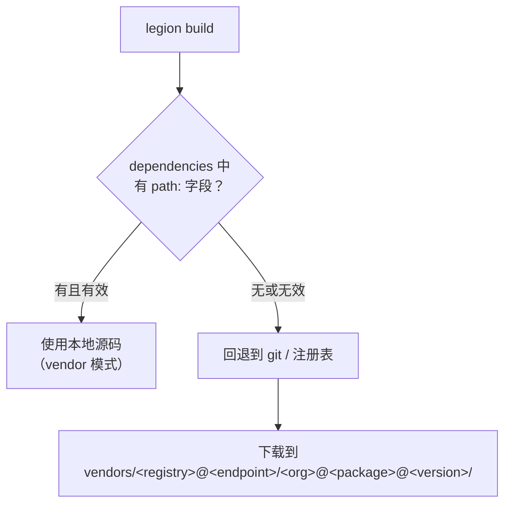
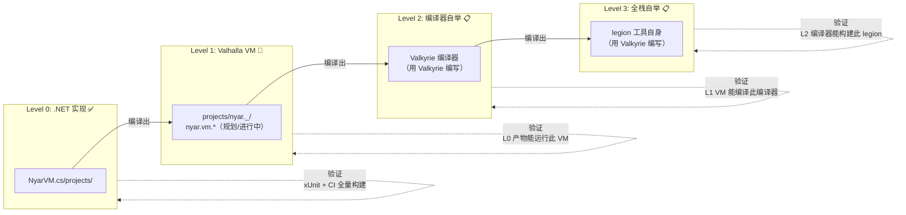
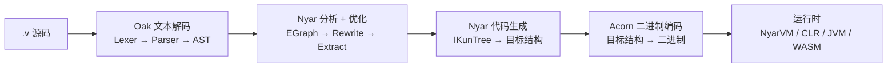
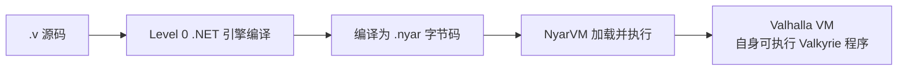
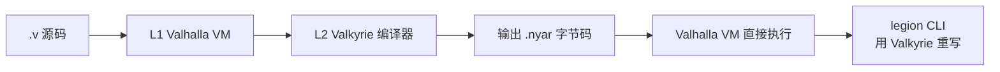
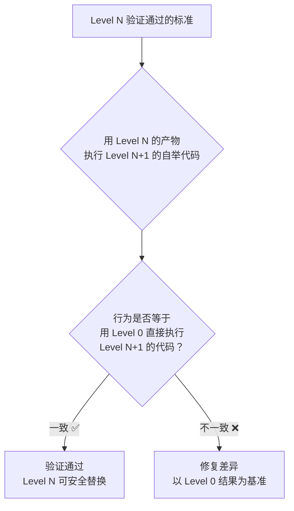
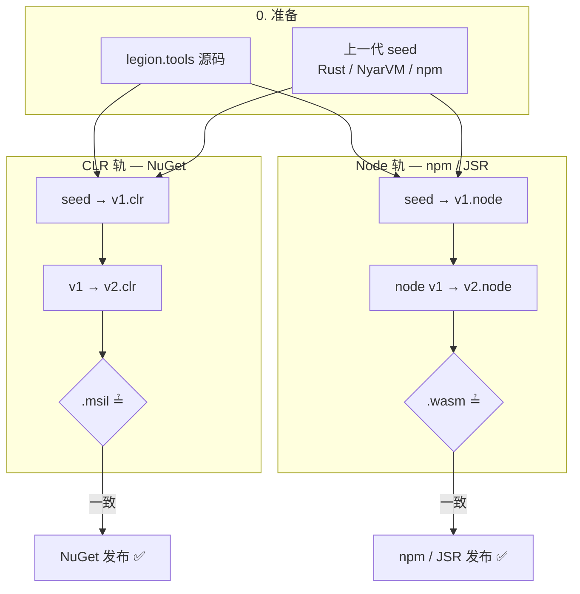
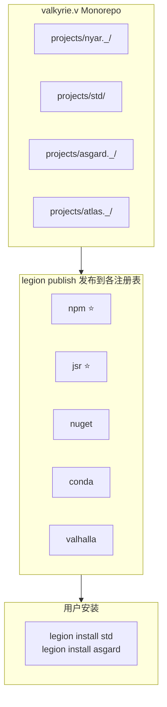
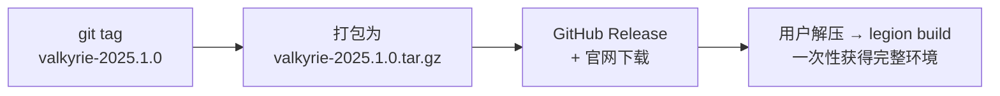
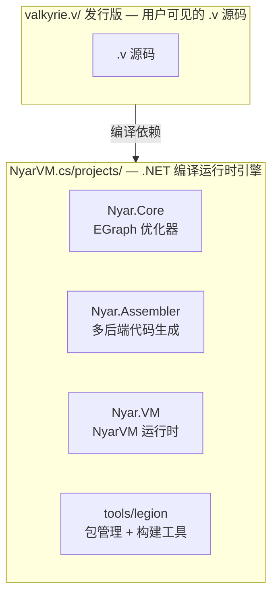

# Valkyrie 语言标准发行版

`valkyrie.v` 是 Valkyrie 语言的 **发行版 monorepo**：它既是 Valkyrie 语言自身的源码发行包，也是生态集成测试的一体化工作空间。

> **Eat your own dogfood.** 这个仓库本身就是一个 `legions.von` super workspace——用 Valkyrie 自己的工具链构建 Valkyrie
> 自己。

---

## 设计原则

### 一、发行版 Monorepo

`valkyrie.v` 将语言核心、标准库、前端框架、云适配器、自举应用全部纳入一个 monorepo。每个子目录是一个可独立发布的 **分发**
（distribution），但聚合在一起构成完整的发行版。

### 二、自举与集成测试一体化

`valkyrie.v` 本身就是最大的集成测试。根 `legions.von` 将所有子项目的所有包平铺为一个超 workspace——一次
`legion build --all` 就是对整个生态的全面验证。没有额外的集成测试框架，因为仓库本身 **就是**集成测试。

### 三、统一使用 vendor 机制区分本地包和远程包

不造一套专门的自举机制。Valkyrie 自带的 **vendor 机制**（`legion.von` 中的 `dependencies` 支持 `path:` 字段）天然区分本地包和远程包，这正是
`valkyrie.v` 内部解引用子 workspace 的方式。

---

## 目录结构

```
valkyrie.v/
│
├── legions.von                   # 超 workspace — 嵌套引用 projects/*. _ 分发入口
│
├── projects/
│   ├── asgard._                  # Asgard 前端框架子 workspace
│   ├── atlas._                   # Atlas 后端框架子 workspace
│   ├── gnosis._                  # Gnosis 自研游戏引擎（规划中）
│   ├── godot._                   # Godot 游戏生态桥接（规划中）
│   ├── legend._                  # Legend 工具子 workspace
│   ├── legion._                  # legion.tools / legion.report
│   ├── nyar._                    # nyar / analyzer / optimizer / emitter / language / vm.*
│   ├── std.data._                # std.data 子 workspace
│   ├── std.adaptors._            # std.adaptor 子 workspace
│   ├── titan._                   # Titan 深度学习框架（规划中）
│   ├── unity._                   # unity.engine.sdk / valkyrie.unity
│   ├── yyds._                    # 数据库生态（规划中）
│   ├── core / std / plotter / …  # 顶层直接成员包
│   └── …
│
├── examples/                     # 示例工程（如 test.module_system）
│
├── documentation/                # 发行版文档站
├── .cache/                       # 构建缓存（不提交）
└── vendors/                      # 远程依赖的本地副本（由 legion install 管理）
```

根 `legions.von` 当前顶层成员（嵌套展开）包括：`projects/asgard._`、`atlas._`、`gnosis._`、`godot._`、`legend._`、`legion._`、
`nyar._`、`std.data._`、`std.adaptors._`、`titan._`、`unity._`、`yyds._`、`core`、`plotter`、`std`、`examples/test.module_system`
等。 **不再**使用顶层 `asgard.v` / `nyar.v` / `tools.v` / `sdk.v` / `bootstrap.v` 目录名；`legion.tools` 与
`valkyrie.unity` 已归位到各自 `*_._/projects/` 下。

---

## 新增生态规划

除现有 `nyar / legion / asgard / atlas / std` 主线外，`valkyrie.v` 还为下列生态预留了独立子 workspace：

| 子 workspace        | 定位           | 说明                                                           |
|:--------------------|:---------------|:---------------------------------------------------------------|
| `projects/unity._`  | Unity 游戏开发 | 面向 Unity 宿主的桥接层、资源流与工具链，不重复发明 Unity 本体 |
| `projects/godot._`  | Godot 游戏开发 | 面向 Godot 宿主的桥接层、场景流与工具链                        |
| `projects/gnosis._` | 自研游戏引擎   | 自研引擎主线，后续承接渲染、场景、资源、物理等能力             |
| `projects/titan._`  | 深度学习框架   | 张量、自动微分、神经网络层与训练工具链                         |
| `projects/yyds._`   | 数据库生态     | `yykv` 存储内核、`yydb` 单机库、`yyds` 分布式库与多协议兼容    |

### 游戏开发分层

游戏开发相关生态目前建议拆成三层来理解，而不是把“引擎”“语言扩展”“底层基础设施”混成一层：

| 层级               | 关注点                                                  | 当前对应                                                                                   |
|:-------------------|:--------------------------------------------------------|:-------------------------------------------------------------------------------------------|
| **游戏引擎产品层** | 编辑器、项目系统、资源工作流、发布流程、平台支持        | `Genesis` 与 `Unity / Godot / Unreal` 属于同层；`Cocos` 是否纳入这层的正式并列范围暂未写死 |
| **游戏开发语义层** | 场景、实体、组件、系统、输入、动画、UI、任务、网络、Mod | 由语言扩展与引擎框架共同承载                                                               |
| **游戏基础设施层** | runtime、graphics、asset、physics、audio、toolchain     | 由 `gnosis` 等共享底座承载                                                                 |

当前约束是：

- `gnosis` 更适合作为 **元游戏引擎 / 基础设施层**
- 具体游戏引擎产品应和 `Unity / Godot / Unreal` 以并列关系理解
- 不在对外定位里把具体引擎产品写成另一个引擎品牌的“下位壳”

### ECS 语言扩展

ECS 语言扩展先按“ **通用核心** + **引擎专属扩展**”两层考虑，暂不写死为 `Genesis` 私有能力。

#### 通用核心

这部分更适合定义为游戏开发的跨引擎核心语义：

- `component`
- `system`
- `query`
- `resource`
- `event`
- `schedule`

#### 引擎专属扩展

这部分保留给具体引擎产品在其框架层追加：

- 例如 `scene`、`prefab`、`quest`、`dialogue`、`world`
- 是否最终表现为 `genesis.*` 专属扩展，还是抽成可被 `Unity / Godot / Cocos` 共同消费的更高层语义，当前 **暂未定案**

当前更稳妥的策略是：

- 先把 ECS 最小核心做成通用语言能力
- 再由具体引擎产品决定是否叠加自己的工作流扩展
- 在没有明确结论前，不把游戏开发语言层过早绑定到单一引擎品牌

### 数据库生态边界

`yyds._` 不是一个单体数据库，而是数据库生态总 workspace：

- `yykv`：共享底层存储内核
- `yydb`：单机数据库，定位接近 `sqlite + redis`
- `yyds`：分布式数据库，协议层兼容 `mysql / pgsql / redis`

其中 `yydb` 与 `yyds` **不是同一个产品**：

- `yydb` 可以独立部署
- `yydb` 可以作为 `yyds` 的 sidecar 高速缓存
- `yydb` 与 `yyds` 可以做升降级、迁移、复制或数据搬运
- 但 `yydb` 不被视为 `yyds` 的子模块，也不应物理并包

---

## Vendor 机制：统一区分本地包与远程包

Valkyrie 的 `legion.von` 依赖声明支持 `path:` 字段，这就是 vendor 机制的核心—— **本地包优先，远程包兜底**。

### 示例：子 workspace 如何引用本地 `std`

```von
# projects/nyar._/legions.von（示意）
dependencies: {
    "core": "0.0.0.0",             # 纯远程依赖 — 从注册表下载到 vendors/
    "std": {
        version: "0.0.0.0",
        path: "../std",            # 本地 vendor 路径 — 优先使用本地源码
        git: "https://github.com/valkyrie/std.git",  # 兜底 — path 不存在时从 git 拉取
    }
}
```

### 解析优先级



### 为什么不需要专门的自举机制

| 场景       | 用户项目            | valkyrie.v 自身      |
|:-----------|:--------------------|:---------------------|
| 引用本地包 | `path: "../my-lib"` | `path: "../std"`     |
| 引用远程包 | `"core": "0.0.0.0"` | `"core": "0.0.0.0"`  |
| 构建命令   | `legion build`      | `legion build --all` |
| 运行测试   | `legion test`       | `legion test --all`  |

**完全相同的机制**。`valkyrie.v` 没有享受任何特殊待遇——它吃的就是自己做的 dogfood。

---

## 两级 Workspace 体系

### 子 workspace（独立开发）

每个子分发有自己独立的 `legions.von`，可以单独开发和测试：

```bash
cd valkyrie.v/projects/nyar._
legion build      # 只构建 Nyar 工具链（language / analyzer / optimizer / emitter …）
legion test       # 只运行该子 workspace 测试
```

### 超 workspace（全量集成）

根 `legions.von` 使用 **嵌套 legions** 引用各分发入口（`projects/asgard._`、`projects/nyar._`、`projects/legion._`、
`projects/unity._` 等），由 Legion 递归展开成员包：

```von
# valkyrie.v/legions.von（示意；以仓库当前文件为准）
name: "valkyrie-super-workspace"
members: [
    "projects/asgard._",
    "projects/atlas._",
    "projects/legion._",
    "projects/nyar._",
    "projects/unity._",
    "projects/std",
    "examples/test.module_system"
]
```

```bash
cd valkyrie.v
legion build --all   # 全量构建 — 这就是集成测试
legion test --all    # 全量测试 — 跨所有子分发的端到端验证
legion bench --all   # 全量基准
```

### 分发 workspace（独立开发）

```bash
cd valkyrie.v/projects/atlas._ && legion build     # 仅 Atlas
cd valkyrie.v/projects/asgard._ && legion build    # 仅 Asgard
cd valkyrie.v/projects/nyar._ && legion build      # 仅 Nyar 工具链
cd valkyrie.v/projects/legion._ && legion build    # 仅 legion.tools / report
```

### Workspace 配置

工作区（Workspace）由根 `legions.von` 描述，用来统一管理多个相互依赖的子包。

```von
{
    version: "1",
    name: "my-workspace",
    members: [
        "packages/core",
        "packages/utils",
        "packages/web"
    ],
    dependencies: {
        "common-lib": "2025.*"
    }
}
```

常见字段：

| 字段           | 类型       | 说明               |
|:---------------|:-----------|:-------------------|
| `version`      | `string`   | 工作区配置格式版本 |
| `name`         | `string`   | 工作区名称         |
| `members`      | `string[]` | 子包路径列表       |
| `dependencies` | `dict`     | 工作区级别共享依赖 |

共享依赖会被子包复用，而根工作区的主要职责始终是：

- 组织成员关系
- 管理共享依赖
- 作为 `legion build --all` / `legion test --all` 的调度入口

---

## 自举与验证机制

Valkyrie 的自举不是一次性事件，而是一个 **逐级替换**的渐进过程。每一级自举完成时，上一级实现自动成为该级的集成测试——这就是
eat your own dogfood 的工程含义。

### 自举阶梯



### 逐级详解

#### Level 0：.NET 实现（当前主力）



**验证方式**：

- `NyarVM.cs/` 的 .NET 单元测试（xUnit）
- `valkyrie.v/` 根 `legions.von` 全量 `legion build --all`
- `legion test --all` 跨所有 28 个语法特性测试包

**这一级的产物**：可以正确编译和执行 Valkyrie 程序的 .NET 引擎。

---

#### Level 1：Valkyrie 自举 VM（当前进行中）



**自举验证**：

- VM / 运行时家族源码与契约在 `projects/nyar._/projects/nyar.vm.*`（ **只消费** emitter 产物，不依赖 `nyar.language`）
- 历史上文档曾写 `bootstrap.v/projects/valkyrie/`；该顶层分发目录 **已不存在**，勿再作路径引用
- Level 0 编译产物后，用 Level 0 的 NyarVM 运行自举 VM，再跑 `examples/` 测试

**验证命令**（以当前子 workspace 为准）：

```bash
cd valkyrie.v/projects/nyar._
legion build
legion test --target nyar
```

**推进条件**：Valhalla VM 通过 28 个语法特性测试，行为与 Level 0 的 NyarVM 一致。

---

#### Level 2：编译器自举（CLR / JVM / Node / WASI 四目标联合门，进行中）

当前验收以 `projects/legion._/projects/legion.tools` 为唯一自举目标， **四目标反作弊联动**：

| 轨       | 目标   | 产物                         | 验收脚本                     | 备注                           |
|:---------|:-------|:-----------------------------|:-----------------------------|:-------------------------------|
| **CLR**  | `clr`  | `legion.exe` + `.msil`       | `bootstrap-clr.mjs`          | 完整 L2 七门                   |
| **JVM**  | `jvm`  | `legion.jar`                 | `bootstrap-jvm.mjs`          | 完整 L2 七门                   |
| **Node** | `node` | `legion.mjs` + `legion.wasm` | `bootstrap-node.mjs`         | 完整 L2 七门；npm / JSR 发布门 |
| **WASI** | `wasi` | `legion.wasi`                | `bootstrap-wasi-witness.mjs` | witness 子集（不要求 v1→v2）   |

- **Rust seed**：`legion bootstrap --project projects/legion._/projects/legion.tools`
- **月度矩阵**：`monthly-matrix.mjs` 聚合四目标 report + `cmds_run` runtime 矩阵
- **反作弊机读**：`check-bootstrap-integrity.mjs`（禁止 stub / bridge / 非 canonical 入口）

**整组 KPI**：任一目标缺席、stub/bridge 检出、或跳过 v1→v2 比对 → **整组失败**（不单记 Node smoke）。

**完整 L2**（CLR / JVM / Node）：seed → v1 可 `build` 同项目 → v2 与 v1 在契约产物上一致。

契约详情：[
`bootstrap-contract.md`](projects/legion._/projects/legion.tools/documentation/pages/zh-hans/bootstrap-contract.md)
npm / JSR 发布：[`publishing-registries.md`](documentation/pages/zh-hans/guides/publishing-registries.md)

---

#### Level 2（远期）：Valhalla VM 全栈编译器自举

#### Level 3：全栈自举（远期）



**自举验证**：`legion build --all` 和 `legion test --all` 在零 .NET 依赖下通过。

---

### 验证闭环



这就是逐级替换的安全保证——永远有上一级作为正确答案兜底。

---

### 自举路线图

| 阶段                   | 状态        | 自举内容                                            | 验证手段                                               |
|:-----------------------|:------------|:----------------------------------------------------|:-------------------------------------------------------|
| **L0 .NET 引擎**       | ✅ 已完成   | 完整的编译+优化+多后端+运行时                       | xUnit + 全量 `legion build --all`                      |
| **L1 Nyar VM**         | 🚧 源码就绪 | Valkyrie 编写的 VM (Executor/Frame/GC)              | L0 编译 L1 VM → L0 NyarVM 运行此 VM → 执行 28 个测试包 |
| **L1.5 std.v 自举**    | 📋          | 标准库用 Valkyrie 编写，经过 L0 编译器 + L1 VM 运行 | `legion test --all` 在 L1 VM 上通过                    |
| **L2 CLR 编译器自举**  | 🚧 进行中   | `legion.tools` seed→v1→v2（CLR）                    | `bootstrap-clr.mjs` + `legion bootstrap`               |
| **L2 JVM 编译器自举**  | 🚧 进行中   | 同上，`--target jvm`                                | `bootstrap-jvm.mjs`                                    |
| **L2 Node 编译器自举** | 🚧 进行中   | 同上，`--target node` → npm / JSR 分发              | `bootstrap-node.mjs`                                   |
| **L2 WASI witness**    | 🚧 进行中   | seed build + `wasmtime run -W gc`                   | `bootstrap-wasi-witness.mjs`                           |
| **L2 VM 编译器自举**   | 📋          | Lexer/Parser/AST→IKun 用 Valkyrie 重写              | L1 VM + L2 编译器编译自身 → 输出一致                   |
| **L3 全栈自举**        | 📋          | `legion` 工具自身用 Valkyrie 编写                   | `legion build --all` 零 .NET 依赖通过                  |

### CI 自举验证管线

发布门为 **四目标联合验收**，共享同一 `legion.tools` 源码、模块系统前置门与 `monthly-matrix.mjs` 汇总：

| 轨          | 验收脚本                        | 通过条件                  |
|:------------|:--------------------------------|:--------------------------|
| **CLR**     | `bootstrap-clr.mjs`             | 完整 L2 七门              |
| **JVM**     | `bootstrap-jvm.mjs`             | 完整 L2 七门              |
| **Node**    | `bootstrap-node.mjs`            | 完整 L2 七门              |
| **WASI**    | `bootstrap-wasi-witness.mjs`    | witness 六门              |
| **Runtime** | `run-runtime-matrix.mjs`        | `cmds_run` 四目标矩阵全绿 |
| **反作弊**  | `check-bootstrap-integrity.mjs` | 零 stub / bridge 检出     |

**任一 job 失败 → 整组阻断发布**（不单记 Node 或 CLR 局部通过）。



#### 平台与注册表分工

- **npm**：CLI 全局命令、`@scope/pkg` 工具包（`legion publish --registry npm`）
- **JSR**：模块化库、TypeScript 友好标准库切片（`legion publish --registry jsr`）
- **NuGet**：CLR 轨 `legion` 工具（与 npm/JSR 不互相替代）

详见 [npm 与 JSR 发布策略](documentation/pages/zh-hans/guides/publishing-registries.md)。

---

## 发布与发行

"发布到包管理器"和"打发行包"是两件独立的事。

### legion publish → 包管理器注册表

每个子分发（`projects/nyar._` / `projects/asgard._` / `projects/atlas._` / `projects/std` 等）可独立发布到各注册表，用户通过
`legion install` 按需获取单个包：



### 发行版打包 → 源码 tarball

`valkyrie.v` 整体作为统一的 **源码发行包**——不打碎、不分立，用户下载一个 tarball 即可获得完整的语言 + 标准库 + 文档 + 测试：



### 对比

| 维度       | `legion publish`                | 发行版打包                  |
|:-----------|:--------------------------------|:----------------------------|
| **粒度**   | 单个包                          | 整个 monorepo               |
| **消费者** | 已有 Valkyrie 环境的开发者      | 新用户 / 离线环境           |
| **命令**   | `legion publish --registry npm` | `git archive` / CI 打包脚本 |
| **类比**   | `npm publish` / `cargo publish` | 传统语言的源码发行版        |

---

## 包目录约定

每个包（无论是 `projects/` 下的库还是 `examples/` 下的测试包）遵循统一的结构：

```
<package>/
├── legion.von         # 包清单 (name, version, dependencies)
├── source/            # 库源码 (*.v)
├── test/              # 测试源码 (*.v) — 仅 legion test 时编译
├── script/            # 可执行脚本入口
├── dist/              # 最终部署产物 (仅 legion build 产出)
└── asgard.config.v       # VOA 前端构建配置 (仅 AWSL 项目)
```

---

## 快速开始

```bash
# 进入发行版根目录
cd valkyrie.v

# 构建全部
legion build --all

# 运行全部测试
legion test --all

# 进入子 workspace 单独开发
cd projects/nyar._
legion build
legion test
```

---

## 与 NyarVM.cs 的关系



`valkyrie.v` 是"什么"，`NyarVM.cs/projects/` 是"怎么做"。前者定义 Valkyrie 生态的形态，后者提供运行它的引擎。
