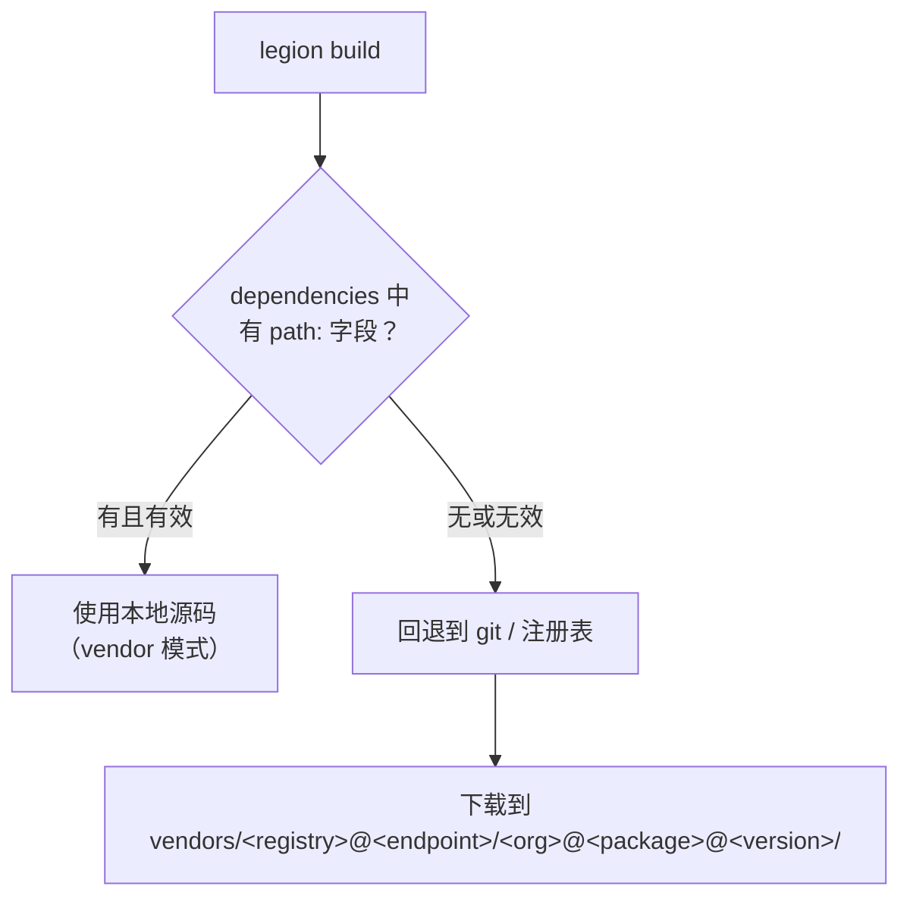
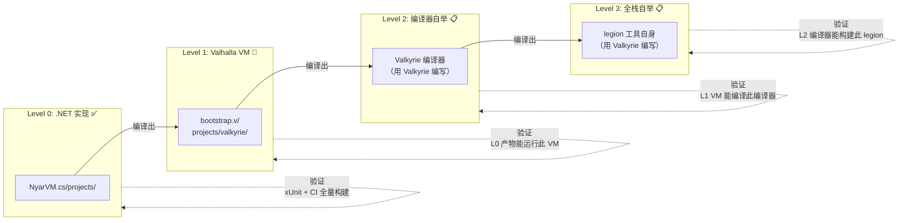
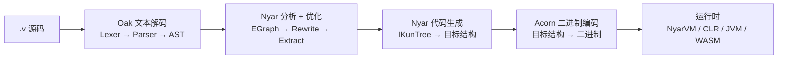
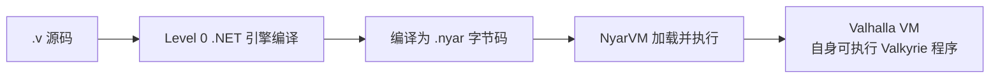
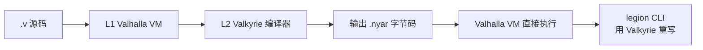
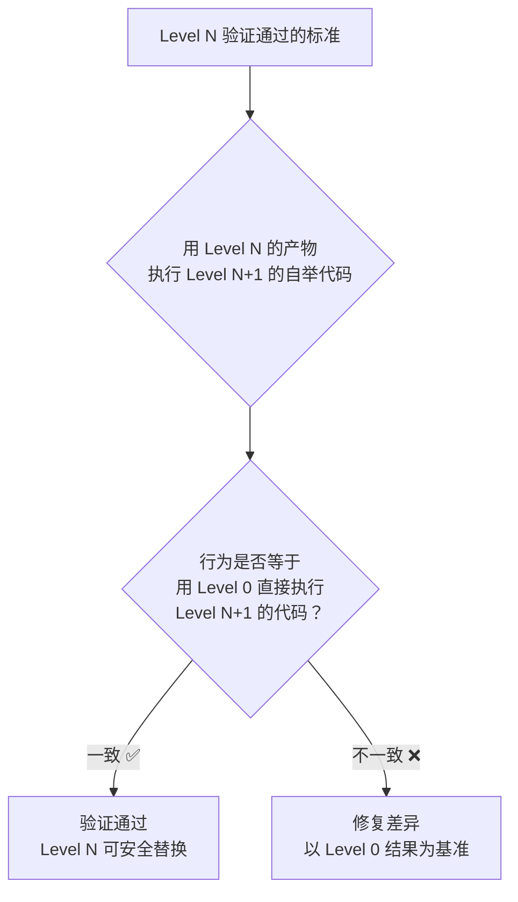
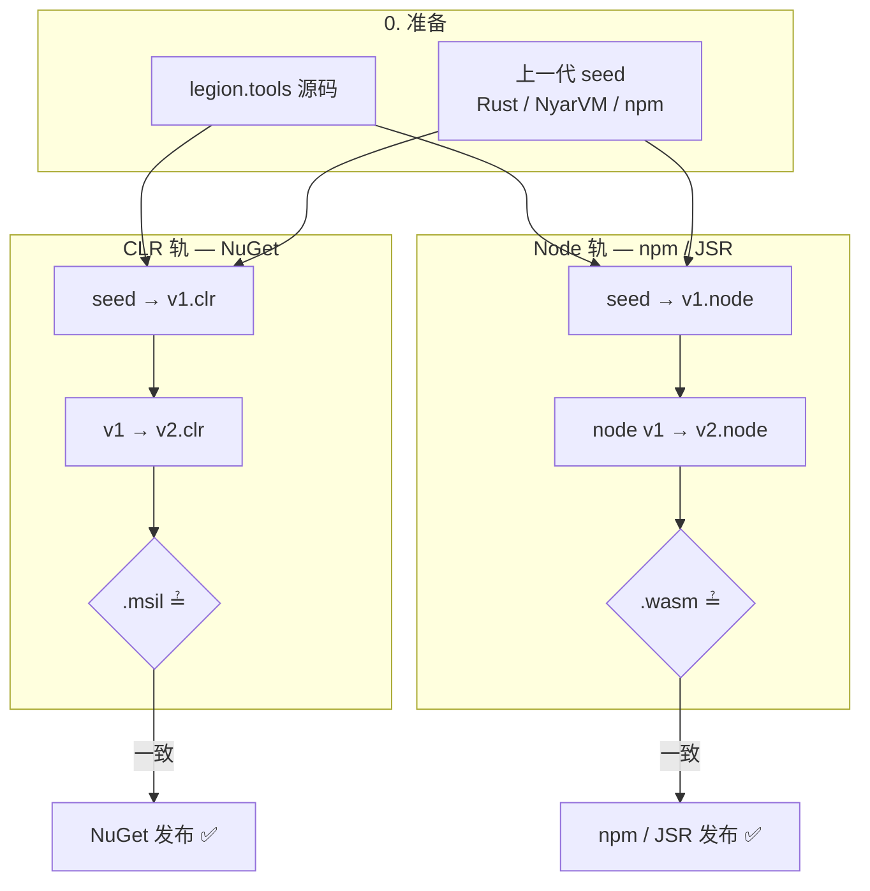
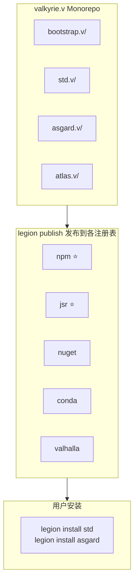
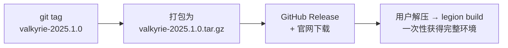
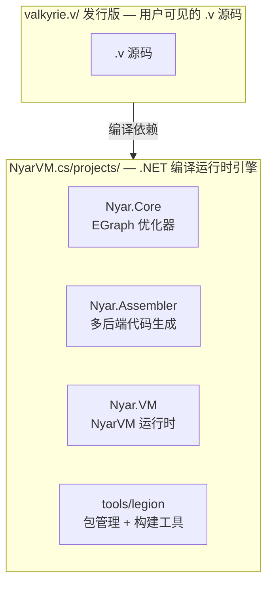

# Valkyrie 语言标准发行版

`valkyrie.v` 是 Valkyrie 语言的 **发行版 monorepo**：它既是 Valkyrie 语言自身的源码发行包，也是生态集成测试的一体化工作空间。

> **Eat your own dogfood.** 这个仓库本身就是一个 `legions.von` super workspace——用 Valkyrie 自己的工具链构建 Valkyrie
> 自己。

---

## 设计原则

### 一、发行版 Monorepo

`valkyrie.v` 将语言核心、标准库、前端框架、云适配器、自举应用全部纳入一个
monorepo。每个子目录是一个可独立发布的 **分发**（distribution），但聚合在一起构成完整的发行版。

### 二、自举与集成测试一体化

`valkyrie.v` 本身就是最大的集成测试。根 `legions.von` 将所有子项目的所有包平铺为一个超 workspace——一次
`legion build --all` 就是对整个生态的全面验证。没有额外的集成测试框架，因为仓库本身 **就是**集成测试。

### 三、统一使用 vendor 机制区分本地包和远程包

不造一套专门的自举机制。Valkyrie 自带的 **vendor 机制**（`legion.von` 中的 `dependencies` 支持 `path:` 字段）天然区分本地包和远程包，这正是
`valkyrie.v` 内部解引用子 workspace 的方式。

---

## 目录结构

```
valkyrie.v/
│
├── legions.von                   # 超 workspace — 嵌套引用 *.v 分发入口
│
├── asgard.v/                     # 分发：前端框架 + 示例
│   └── legions.von
├── atlas.v/                      # 分发：后端 API 框架（嵌套 → projects/atlas）
│   └── legions.von
├── nyar.v/                       # 分发：Nyar 编译器与包管理
│   └── legions.von
├── std.v/                        # 分发：标准库 + adaptor + std-data
│   └── legions.von
├── tools.v/                      # 分发：legion / legend / asgard / atlas CLI
│   └── legions.von
├── examples.v/                   # 分发：跨框架集成示例
│   └── legions.von
├── sdk.v/                        # 分发：微信 / Unity 等第三方 SDK
│   └── legions.von
│
├── bootstrap.v/                  # 分发：Valkyrie 语言核心（规划中）
│   └── legions.von
├── projects/                     # 实际包源码（由各 *.v/legions.von 引用）
│   ├── atlas/                    # Atlas 子 workspace（projects/atlas/*）
│   ├── asgard/                   # Asgard 核心
│   ├── nyar/                     # Nyar 核心
│   ├── std/                      # 标准库
│   └── ...
│
├── examples/                     # 示例工程（部分由 asgard.v / examples.v 引用）
│
├── .cache/                       # 构建缓存（不提交）
└── vendors/                      # 远程依赖的本地副本（由 legion install 管理）
```

---

## Vendor 机制：统一区分本地包与远程包

Valkyrie 的 `legion.von` 依赖声明支持 `path:` 字段，这就是 vendor 机制的核心—— **本地包优先，远程包兜底**。

### 示例：bootstrap.v 如何引用 std.v

```von
# bootstrap.v/legions.von
dependencies: {
    "core": "0.0.0.0",             # 纯远程依赖 — 从注册表下载到 vendors/
    "std": {
        version: "0.0.0.0",
        path: "../std.v",          # 本地 vendor 路径 — 优先使用本地源码
        git: "https://github.com/valkyrie/std.v.git",  # 兜底 — path 不存在时从 git 拉取
    }
}
```

### 解析优先级



### 为什么不需要专门的自举机制

| 场景       | 用户项目            | valkyrie.v 自身      |
|:-----------|:--------------------|:---------------------|
| 引用本地包 | `path: "../my-lib"` | `path: "../std.v"`   |
| 引用远程包 | `"core": "0.0.0.0"` | `"core": "0.0.0.0"`  |
| 构建命令   | `legion build`      | `legion build --all` |
| 运行测试   | `legion test`       | `legion test --all`  |

**完全相同的机制**。`valkyrie.v` 没有享受任何特殊待遇——它吃的就是自己做的 dogfood。

---

## 两级 Workspace 体系

### 子 workspace（独立开发）

每个子分发有自己独立的 `legions.von`，可以单独开发和测试：

```bash
cd valkyrie.v/bootstrap.v
legion build      # 只构建 Valkyrie 语言核心
legion test       # 只运行语言特性测试
```

### 超 workspace（全量集成）

根 `legions.von` 使用 **嵌套 legions** 引用各分发入口（`asgard.v`、`atlas.v`、`nyar.v`、`std.v` 等），由 Legion 递归展开成员包：

```von
# valkyrie.v/legions.von
name: "valkyrie-super-workspace"
members: [
    "asgard.v",
    "atlas.v",
    "nyar.v",
    "std.v",
    "tools.v",
    "examples.v",
    "sdk.v"
]
```

```bash
cd valkyrie.v
legion build --all   # 全量构建 — 这就是集成测试
legion test --all    # 全量测试 — 跨所有子分发的端到端验证
legion bench --all   # 全量基准
```

### 分发 workspace（独立开发）

```bash
cd valkyrie.v/atlas.v && legion build    # 仅 Atlas
cd valkyrie.v/asgard.v && legion build   # 仅 Asgard
cd valkyrie.v/nyar.v && legion build     # 仅 Nyar 工具链
cd valkyrie.v/std.v && legion build      # 仅标准库
```

---

## 自举与验证机制

Valkyrie 的自举不是一次性事件，而是一个 **逐级替换**的渐进过程。每一级自举完成时，上一级实现自动成为该级的集成测试——这就是
eat your own dogfood 的工程含义。

### 自举阶梯



### 逐级详解

#### Level 0：.NET 实现（当前主力）



**验证方式**：

- `NyarVM.cs/` 的 .NET 单元测试（xUnit）
- `valkyrie.v/` 根 `legions.von` 全量 `legion build --all`
- `legion test --all` 跨所有 28 个语法特性测试包

**这一级的产物**：可以正确编译和执行 Valkyrie 程序的 .NET 引擎。

---

#### Level 1：Valkyrie 自举 VM（当前进行中）



**自举验证**：

- `bootstrap.v/projects/valkyrie/source/vm.v` 中定义了 `Executor`、`Frame`、`Stack`、`Heap`
- Level 0 编译 Valhalla 为字节码后，用 Level 0 的 NyarVM 运行它
- 然后用这个 Valhalla VM 再去运行 `examples/` 中的测试——如果通过，则 VM 自举成功

**验证命令**：

```bash
cd valkyrie.v/bootstrap.v
legion build                          # Level 0 编译 Valhalla
legion test --target nyar             # Level 0 的 NyarVM 运行 Valhalla VM 执行测试
```

**推进条件**：Valhalla VM 通过 28 个语法特性测试，行为与 Level 0 的 NyarVM 一致。

---

#### Level 2：编译器自举（CLR + Node 双轨，进行中）

当前双线验收以 `projects/legion.tools` 为唯一自举目标，分 **两条并行轨**：

| 轨 | 目标 | 产物 | 主发布平台 | 验收 |
|:---|:---|:---|:---|:---|
| **CLR** | `clr` | `legion.exe` + `.msil` | NuGet | `bootstrap-clr.mjs` |
| **Node** | `node` → `wasm32-node-unknown-wasm` | `legion.mjs` + `legion.wasm` | **npm**、**JSR** | `bootstrap-node.mjs` |

- **Rust seed（CLR）**：`legion bootstrap --project projects/legion.tools`
- **发行版 CLR 验收**：`node scripts/bootstrap-clr.mjs`
- **发行版 Node 验收**：`node scripts/bootstrap-node.mjs`（npm / JSR 公开发布前置门）

**自举阶段划分**（两轨相同）：

- **seed 阶段**（合法）：Rust / NyarVM.cs / NuGet / **npm·JSR 已发包**（固定版本）编译 `legion.tools` → v1
- **自举阶段**（v1→v2）：必须由 v1 进程内编译管线完成，禁止 bridge
- **CLR smoke**：`bootstrap-smoke-clr.mjs` 验收 v1 编译 `examples/bootstrap-smoke`

**完整 L2**：seed → v1 可 `build` 同项目 → v2 与 v1 在契约产物上一致（CLR：`.msil`；Node：`.wasm`）。

契约详情：[`bootstrap-contract.md`](projects/legion.tools/documentation/pages/zh-hans/bootstrap-contract.md)  
npm / JSR 发布：[`publishing-registries.md`](documentation/pages/zh-hans/guides/publishing-registries.md)

---

#### Level 2（远期）：Valhalla VM 全栈编译器自举

#### Level 3：全栈自举（远期）



**自举验证**：`legion build --all` 和 `legion test --all` 在零 .NET 依赖下通过。

---

### 验证闭环



这就是逐级替换的安全保证——永远有上一级作为正确答案兜底。

---

### 自举路线图

| 阶段                | 状态        | 自举内容                                            | 验证手段                                               |
|:--------------------|:------------|:----------------------------------------------------|:-------------------------------------------------------|
| **L0 .NET 引擎**    | ✅ 已完成   | 完整的编译+优化+多后端+运行时                       | xUnit + 全量 `legion build --all`                      |
| **L1 Nyar VM**      | 🚧 源码就绪 | Valkyrie 编写的 VM (Executor/Frame/GC)              | L0 编译 L1 VM → L0 NyarVM 运行此 VM → 执行 28 个测试包 |
| **L1.5 std.v 自举** | 📋          | 标准库用 Valkyrie 编写，经过 L0 编译器 + L1 VM 运行 | `legion test --all` 在 L1 VM 上通过                    |
| **L2 CLR 编译器自举** | 🚧 进行中   | `legion.tools` seed→v1→v2（CLR）                    | `bootstrap-clr.mjs` + `legion bootstrap`               |
| **L2 Node 编译器自举** | 🚧 进行中   | 同上，`--target node` → npm / JSR 分发              | `bootstrap-node.mjs`                                   |
| **L2 VM 编译器自举**  | 📋          | Lexer/Parser/AST→IKun 用 Valkyrie 重写              | L1 VM + L2 编译器编译自身 → 输出一致                   |
| **L3 全栈自举**     | 📋          | `legion` 工具自身用 Valkyrie 编写                   | `legion build --all` 零 .NET 依赖通过                  |

### CI 自举验证管线

发布门分 **两条轨**，共享同一 `legion.tools` 源码与模块系统前置门，但阻断的发布物不同：

| 轨 | 验收脚本 | 通过后可发布 |
|:---|:---|:---|
| **CLR** | `bootstrap-clr.mjs` | NuGet / .NET 工具链 |
| **Node** | `bootstrap-node.mjs` | **npm**、**JSR** |

`JVM`、浏览器 `wasm`、实验性 `scripts/experimental/*` **不计入**上述发布门。



#### 平台与注册表分工

- **npm**：CLI 全局命令、`@scope/pkg` 工具包（`legion publish --registry npm`）
- **JSR**：模块化库、TypeScript 友好标准库切片（`legion publish --registry jsr`）
- **NuGet**：CLR 轨 `legion` 工具（与 npm/JSR 不互相替代）

详见 [npm 与 JSR 发布策略](documentation/pages/zh-hans/guides/publishing-registries.md)。

---

## 发布与发行

"发布到包管理器"和"打发行包"是两件独立的事。

### legion publish → 包管理器注册表

每个子分发（bootstrap.v / std.v / asgard.v / atlas.v）可独立发布到各注册表， 用户通过 `legion install` 按需获取单个包：



### 发行版打包 → 源码 tarball

`valkyrie.v` 整体作为统一的 **源码发行包**——不打碎、不分立，用户下载一个 tarball 即可获得完整的语言 + 标准库 +
文档 + 测试：



### 对比

| 维度       | `legion publish`                | 发行版打包                           |
|:-----------|:--------------------------------|:-------------------------------------|
| **粒度**   | 单个包                          | 整个 monorepo                        |
| **消费者** | 已有 Valkyrie 环境的开发者      | 新用户 / 离线环境                    |
| **命令**   | `legion publish --registry npm` | `git archive` / CI 打包脚本          |
| **类比**   | `npm publish` / `cargo publish` | 传统语言的源码发行版 |

---

## 包目录约定

每个包（无论是 `projects/` 下的库还是 `examples/` 下的测试包）遵循统一的结构：

```
<package>/
├── legion.von         # 包清单 (name, version, dependencies)
├── source/            # 库源码 (*.v)
├── test/              # 测试源码 (*.v) — 仅 legion test 时编译
├── script/            # 可执行脚本入口
├── dist/              # 最终部署产物 (仅 legion build 产出)
└── voa.config.v       # VOA 前端构建配置 (仅 AWSL 项目)
```

---

## 快速开始

```bash
# 进入发行版根目录
cd valkyrie.v

# 构建全部
legion build --all

# 运行全部测试
legion test --all

# 进入子 workspace 单独开发
cd bootstrap.v
legion build
legion test --target nyar
```

---

## 与 NyarVM.cs 的关系



`valkyrie.v` 是"什么"，`NyarVM.cs/projects/` 是"怎么做"。前者定义 Valkyrie 生态的形态，后者提供运行它的引擎。
